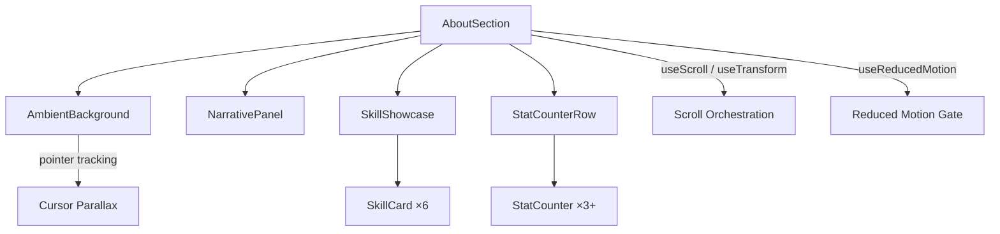
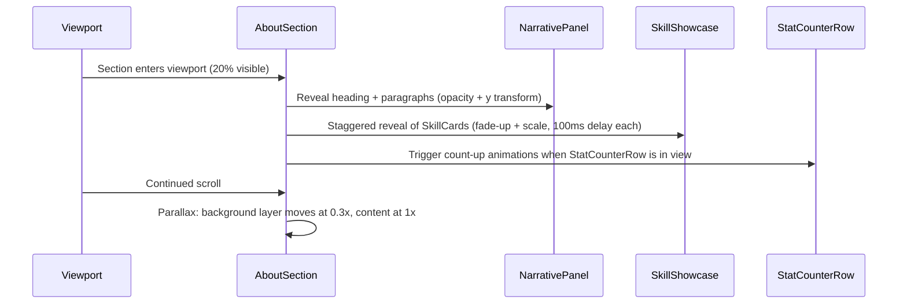

# Design Document: About Section Redesign

## Overview

This design covers the complete rewrite of the About section from a simple 2-column grid (accordion skill list + plain text) into an immersive, scroll-driven, dark-themed experience. The redesign introduces:

- A full-width dark section with animated ambient background (gradient orbs, grain texture)
- Scroll-driven content orchestration via Framer Motion's `useScroll`/`useTransform`
- Six glassmorphism skill cards with 3D tilt, glow effects, and staggered reveals
- A narrative panel with typographic hierarchy (Poppins heading, gradient text)
- Animated statistics counters with count-up animations
- Cursor-tracking micro-interactions on the ambient background
- Full reduced-motion support via the existing `useReducedMotion` hook

The existing `AboutSection.tsx` will be completely rewritten. `AboutIllustration.tsx` will be replaced by new sub-components. The section retains `id="about"` for scroll-spy compatibility and stays within the `max-w-[1400px]` content constraint used site-wide.

### Key Design Decisions

1. **Component decomposition over monolith**: The section is split into focused sub-components (`AmbientBackground`, `SkillCard`, `StatCounter`, `NarrativePanel`) to keep each file small and testable. The parent `AboutSection` orchestrates layout and scroll logic.
2. **Framer Motion scroll primitives**: Using `useScroll({ target, offset })` + `useTransform` for parallax and reveals rather than raw `IntersectionObserver` or scroll listeners — this leverages FM's optimized motion value system (Requirement 9.5).
3. **CSS-only glassmorphism**: Skill card glass effect uses `backdrop-filter: blur()` + semi-transparent borders via Tailwind utilities, avoiding JS-driven blur calculations.
4. **3D tilt via pointer events**: Tilt is computed from `onPointerMove` relative coordinates, applied as `rotateX`/`rotateY` transforms. Disabled on touch devices (< 1024px) per Requirement 8.4.
5. **Count-up via `useTransform` + `useInView`**: Stat counters animate using a spring-driven motion value rather than `setInterval`, keeping the animation frame-synced and interruptible.

## Architecture



### Component Tree

```
<section id="about">                    ← AboutSection (scroll orchestrator)
  <AmbientBackground />                 ← gradient orbs, grain, cursor tracking
  <div.content-wrapper>
    <NarrativePanel />                  ← heading, 4 paragraphs, CTA paragraph
    <SkillShowcase>                     ← creative layout wrapper
      <SkillCard /> ×6                  ← glassmorphism, 3D tilt, glow
    </SkillShowcase>
    <StatCounterRow>                    ← horizontal stat strip
      <StatCounter /> ×3+              ← count-up animation
    </StatCounterRow>
  </div.content-wrapper>
</section>
```

### Scroll Orchestration Flow



## Components and Interfaces

### AboutSection (Parent Orchestrator)

**File:** `src/components/AboutSection.tsx`

```typescript
// Complete rewrite of existing file
// Responsibilities:
// - Section layout with id="about"
// - useScroll/useTransform for scroll progress
// - useReducedMotion gate for all child animations
// - Responsive layout switching (vertical mobile, creative desktop)

interface AboutSectionProps {} // No props — self-contained section
```

Key behaviors:
- Uses `useScroll({ target: sectionRef, offset: ["start end", "end start"] })` to get `scrollYProgress`
- Derives `backgroundY`, `contentY` parallax values via `useTransform`
- Passes `reducedMotion` boolean down to children (or they call the hook themselves)
- Layout: On desktop (md+), uses CSS Grid with named areas for asymmetric positioning. On mobile, single column stack.

### AmbientBackground

**File:** `src/components/about/AmbientBackground.tsx`

```typescript
interface AmbientBackgroundProps {
  scrollProgress: MotionValue<number>;  // from parent's useScroll
  reducedMotion: boolean;
}
```

Renders:
- 2-3 gradient orbs (`radial-gradient`) as `motion.div` elements
- Grain texture overlay (CSS `background-image` with noise SVG or tiny repeating pattern)
- All elements have `pointer-events: none` and `aria-hidden="true"`
- Orbs animate with slow floating keyframes (`y: [0, -20, 0]`, `x: [0, 15, 0]`) over 15-20s
- Cursor tracking: listens to parent's `onPointerMove`, shifts orb positions with dampened `useSpring`
- When `reducedMotion` is true: static positions, no animation, no cursor tracking

### SkillCard

**File:** `src/components/about/SkillCard.tsx`

```typescript
interface SkillCardProps {
  icon: React.ReactNode;
  name: string;
  subtitle: string;
  description: string;
  tags: string[];
  accentColor: string;          // e.g., '#f472b6'
  reducedMotion: boolean;
  disableTilt: boolean;         // true on touch devices (< 1024px)
}
```

Renders:
- Glassmorphism container: `bg-white/[0.06] backdrop-blur-[20px] border border-white/[0.1] rounded-2xl`
- Icon in accent-colored container
- Title (white, font-bold), subtitle (gray-400), description (gray-400, smaller)
- Tags as pill badges: `bg-{accent}/10 text-{accent}` (inline styles since colors are dynamic)
- 3D tilt: `onPointerMove` computes `rotateX`/`rotateY` from cursor position, max ±8deg. `onPointerLeave` resets to 0.
- Glow on hover/focus: `box-shadow: 0 0 40px {accentColor}40`
- Keyboard focus: same glow via `:focus-visible` or `onFocus`/`onBlur` state
- `tabIndex={0}`, `role="article"`, `aria-label="{name} skill domain"`

### StatCounter

**File:** `src/components/about/StatCounter.tsx`

```typescript
interface StatCounterProps {
  target: number;               // final number to count to
  suffix?: string;              // e.g., "+"
  label: string;                // descriptive label below number
  reducedMotion: boolean;
}
```

Renders:
- Uses `useInView` to trigger animation
- Animates from 0 to `target` using `useMotionValue` + `useSpring` + `useTransform` to round to integer
- Duration ~2s with ease-out spring config (`stiffness: 50, damping: 20`)
- Poppins font, font-weight 700+, 36px+ on desktop
- Label in gray-400, 13-14px
- `aria-label="{target}{suffix} {label}"` for screen readers
- When `reducedMotion`: shows final value immediately, no animation

### NarrativePanel

**File:** `src/components/about/NarrativePanel.tsx`

```typescript
interface NarrativePanelProps {
  reducedMotion: boolean;
}
```

Renders:
- Section label: `<span className="section-label">About</span>`
- `<h2>` with Poppins, 42px desktop, gradient text (`bg-gradient-to-r from-white to-coral-400 bg-clip-text text-transparent`)
- 4 `<p>` elements with `text-gray-300` (contrast ratio ~7:1 against dark-900), `leading-[1.75]`, `mb-4`
- Final paragraph styled distinctly: `text-gray-200 font-medium border-l-2 border-coral-500 pl-4`
- Content is hardcoded (same text as current `AboutSection.tsx`)

### SkillShowcase (Layout Wrapper)

**File:** `src/components/about/SkillShowcase.tsx`

```typescript
interface SkillShowcaseProps {
  reducedMotion: boolean;
  children?: React.ReactNode;   // or renders SkillCards internally
}
```

- Wraps the 6 `SkillCard` components in a creative bento-grid layout
- Desktop: CSS Grid with `grid-template-columns` and `grid-template-rows` creating varied card sizes (some span 2 cols, some are taller)
- Mobile (< 768px): single column stack
- Tablet (768-1023px): 2-column uniform grid
- Handles staggered reveal animation via `staggerChildren` variant

### StatCounterRow

Thin wrapper rendering 3+ `StatCounter` components in a horizontal flex/grid row. Centered, with dividers between counters on desktop.

## Data Models

### Skill Domain Data

The existing `LAYERS` array from `AboutIllustration.tsx` is reused as the data source, restructured as a typed constant:

```typescript
// src/data/aboutData.ts

export interface SkillDomain {
  name: string;
  subtitle: string;
  description: string;
  tags: string[];
  accentColor: string;
  icon: string;  // icon identifier — rendered by SkillCard
}

export interface StatMetric {
  value: number;
  suffix: string;
  label: string;
}

export const SKILL_DOMAINS: SkillDomain[] = [
  {
    name: 'UI/UX Design',
    subtitle: 'Figma • Google Stitch • Prototyping',
    description: 'Translating business requirements into intuitive wireframes and interactive prototypes...',
    tags: ['Figma', 'Google Stitch', 'Wireframing', 'Prototyping'],
    accentColor: '#f472b6',
    icon: 'design',
  },
  // ... 5 more domains matching existing LAYERS data
];

export const STAT_METRICS: StatMetric[] = [
  { value: 6, suffix: '+', label: 'Years Experience' },
  { value: 50, suffix: '+', label: 'Projects Delivered' },
  { value: 25, suffix: '+', label: 'Technologies' },
];

export const NARRATIVE_PARAGRAPHS: string[] = [
  'With 6+ years of hands-on experience...',
  'I\'ve delivered mission-critical projects...',
  'Beyond technical capability...',
  'If you\'re looking for an engineer...',  // CTA paragraph (styled differently)
];
```

### Motion Configuration

```typescript
// Added to src/utils/motionVariants.ts

export const skillCardReveal: Variants = {
  hidden: { opacity: 0, y: 30, scale: 0.95 },
  visible: {
    opacity: 1,
    y: 0,
    scale: 1,
    transition: { duration: 0.6, ease: 'easeOut' },
  },
};

export const staggerSkillCards: Variants = {
  hidden: { opacity: 0 },
  visible: {
    opacity: 1,
    transition: { staggerChildren: 0.1, delayChildren: 0.2 },
  },
};
```

No database or API models — all data is static and co-located.

## Correctness Properties

*A property is a characteristic or behavior that should hold true across all valid executions of a system — essentially, a formal statement about what the system should do. Properties serve as the bridge between human-readable specifications and machine-verifiable correctness guarantees.*

### Property 1: Tilt calculation stays within rotation bounds

*For any* card dimensions (width > 0, height > 0) and *for any* cursor position (x, y) within those bounds, the tilt calculation function SHALL produce `rotateX` and `rotateY` values each within the range [-8, 8] degrees inclusive.

**Validates: Requirements 4.2**

### Property 2: SkillCard renders all required content and accessibility attributes

*For any* valid `SkillDomain` object (with non-empty name, subtitle, and tags array), the rendered `SkillCard` SHALL contain the skill name, subtitle, every tag from the tags array, have `tabIndex=0`, and include an `aria-label` attribute containing the skill name.

**Validates: Requirements 4.5, 10.2**

### Property 3: StatCounter aria-label contains full metric description

*For any* valid `StatMetric` object (with a numeric value, suffix string, and label string), the rendered `StatCounter` SHALL include an `aria-label` attribute containing the value, suffix, and label text.

**Validates: Requirements 10.4**

## Error Handling

This feature is a self-contained UI section with no external API calls, database operations, or user input processing. Error scenarios are minimal:

| Scenario | Handling |
|---|---|
| `useReducedMotion` hook fails (SSR or missing `window.matchMedia`) | Hook already returns `false` as default — animations proceed normally |
| Framer Motion `useScroll` called outside viewport context | `scrollYProgress` defaults to 0 — content renders in initial state, no crash |
| Missing or malformed skill domain data | TypeScript types enforce shape at compile time; data is hardcoded, not user-supplied |
| `backdrop-filter` not supported (older browsers) | Glassmorphism degrades gracefully to solid semi-transparent background — no functional impact |
| `pointer-events` on ambient background accidentally captures clicks | All ambient elements use `pointer-events: none` (Req 9.3) — enforced in component |
| 3D tilt calculation receives zero-dimension card | Guard clause returns `{ rotateX: 0, rotateY: 0 }` when width or height is 0 |

No try/catch blocks or error boundaries are needed for this feature. All failure modes degrade gracefully to static content.

## Testing Strategy

### Unit Tests (Example-Based)

Focus on concrete rendering checks and conditional behavior:

- **AboutSection rendering**: Verify `id="about"`, `bg-dark-900` class, `section-label` element, `max-w-[1400px]` wrapper, semantic HTML (`section`, `h2`, `p`)
- **AmbientBackground**: Verify ≥2 gradient orb elements, `pointer-events: none`, `aria-hidden="true"` on all decorative elements, grain overlay present
- **AmbientBackground reduced motion**: With `reducedMotion=true`, verify no animation props
- **NarrativePanel**: Verify Poppins heading with gradient text classes, 4 paragraphs, CTA paragraph with distinct styling (border-l, font-medium)
- **SkillShowcase**: Verify 6 SkillCard components rendered
- **SkillCard glassmorphism**: Verify backdrop-filter and semi-transparent background styles
- **SkillCard keyboard focus**: Simulate focus, verify glow styles applied
- **SkillCard tilt disabled**: With `disableTilt=true`, simulate pointer move, verify no rotation
- **StatCounter rendering**: Verify Poppins font, ≥36px size class, label element in gray-400
- **StatCounter reduced motion**: With `reducedMotion=true`, verify displayed value equals target immediately
- **Reduced motion gate**: Verify all components suppress animations when `reducedMotion=true`

### Property-Based Tests

Using `fast-check` (already in devDependencies). Minimum 100 iterations per property.

| Property | Test Description | Tag |
|---|---|---|
| Property 1 | Generate random `{ width, height, cursorX, cursorY }` within valid ranges. Assert `calculateTilt()` returns rotations in [-8, 8]. | `Feature: about-section-redesign, Property 1: Tilt calculation stays within rotation bounds` |
| Property 2 | Generate random `SkillDomain` objects with arbitrary strings/arrays. Render `SkillCard`, assert name, subtitle, all tags present in DOM, `tabIndex=0`, and `aria-label` contains name. | `Feature: about-section-redesign, Property 2: SkillCard renders all required content and accessibility attributes` |
| Property 3 | Generate random `StatMetric` objects with arbitrary numbers/strings. Render `StatCounter` with `reducedMotion=true`, assert `aria-label` contains value, suffix, and label. | `Feature: about-section-redesign, Property 3: StatCounter aria-label contains full metric description` |

### What Is NOT Tested

- Visual appearance (glassmorphism look, gradient aesthetics, parallax feel) — requires manual review or visual regression tools
- Responsive breakpoint behavior — requires real viewport simulation (Playwright/Cypress)
- Animation timing and easing curves — requires animation timeline inspection
- Scroll-driven orchestration sequencing — tightly coupled to Framer Motion internals
- CLS and performance metrics — requires Lighthouse or real browser profiling
