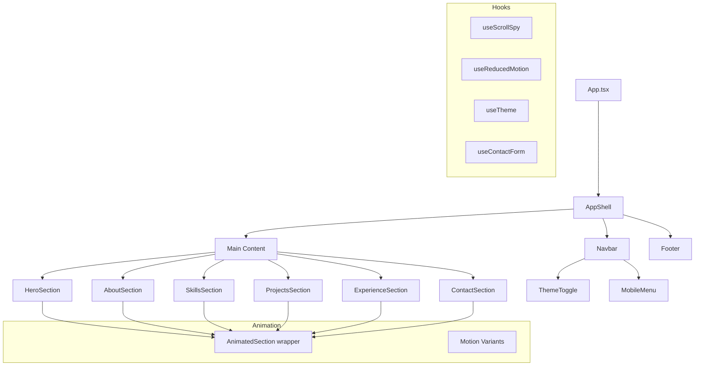

# Design Document: Portfolio Site

## Overview

This design describes a single-page portfolio application built with React 18+, TypeScript, Framer Motion, and Tailwind CSS. The app is structured as a vertically scrolling page with distinct sections (Hero, About, Skills, Projects, Experience, Contact, Footer) wrapped in an application shell with a fixed navigation bar.

The architecture prioritizes:
- Component isolation — each section is a self-contained React component
- Animation consistency — a shared animation system powered by Framer Motion with scroll-triggered reveals and reduced-motion support
- Theme flexibility — Tailwind CSS with CSS custom properties enabling dark/light mode toggling
- Responsive-first design — mobile-first Tailwind breakpoints with a primary breakpoint at 768px

The project will be scaffolded with Vite for fast development and optimized production builds.

## Architecture



### Project Structure

```
src/
├── App.tsx                    # Root component, theme provider
├── main.tsx                   # Entry point
├── index.css                  # Tailwind directives, CSS custom properties
├── components/
│   ├── Navbar.tsx             # Fixed navbar + hamburger menu
│   ├── ThemeToggle.tsx        # Dark/light mode toggle button
│   ├── HeroSection.tsx        # Hero with animated background
│   ├── AboutSection.tsx       # Bio + photo two-column layout
│   ├── SkillsSection.tsx      # Categorized skills with progress bars
│   ├── SkillBar.tsx           # Individual animated skill indicator
│   ├── ProjectsSection.tsx    # Project grid with filter
│   ├── ProjectCard.tsx        # Individual project card
│   ├── ExperienceSection.tsx  # Timeline layout
│   ├── TimelineEntry.tsx      # Individual timeline item
│   ├── ContactSection.tsx     # Contact form + social links
│   ├── Footer.tsx             # Footer nav + social + copyright
│   └── AnimatedSection.tsx    # Reusable scroll-triggered animation wrapper
├── hooks/
│   ├── useScrollSpy.ts        # Tracks which section is in view
│   ├── useReducedMotion.ts    # Detects prefers-reduced-motion
│   ├── useTheme.ts            # Dark/light mode state management
│   └── useContactForm.ts     # Form state, validation, submission
├── data/
│   ├── skills.ts              # Skills data (categories, names, levels)
│   ├── projects.ts            # Projects data (title, desc, tech, links)
│   └── experience.ts          # Experience data (company, role, dates)
├── utils/
│   ├── validation.ts          # Email and form validation functions
│   └── motionVariants.ts      # Shared Framer Motion animation variants
└── types/
    └── index.ts               # TypeScript interfaces and types
```

### Key Architectural Decisions

1. **Vite over CRA/Next.js**: This is a static SPA with no server-side rendering needs. Vite provides faster builds and HMR.

2. **CSS Custom Properties for theming**: Tailwind classes reference CSS variables that change on theme toggle, enabling instant theme switching without re-rendering the component tree.

3. **AnimatedSection wrapper**: A single reusable component wraps each section, using Framer Motion's `useInView` with a 0.2 threshold (20% visibility) to trigger entrance animations. This centralizes animation logic.

4. **Data-driven sections**: Skills, projects, and experience data live in typed data files, making content updates trivial without touching component code.

5. **Form validation in a custom hook**: `useContactForm` encapsulates all form state, validation logic, and submission handling, keeping the ContactSection component focused on rendering.

## Components and Interfaces

### App (App.tsx)
Root component. Wraps the entire app in a `ThemeProvider` context. Renders `Navbar`, all section components in order, and `Footer`.

### Navbar
- Fixed position at viewport top (`fixed top-0 z-50`)
- Renders navigation links for each section
- Uses `useScrollSpy` to highlight the active section link
- On viewports < 768px, collapses to a hamburger icon that toggles a vertical overlay menu
- Contains `ThemeToggle` component
- Smooth-scroll on link click via `element.scrollIntoView({ behavior: 'smooth' })`

```typescript
interface NavLink {
  label: string;
  sectionId: string;
}
```

### ThemeToggle
- Button that toggles between dark and light mode
- Calls `useTheme().toggle()`
- Renders sun/moon icon based on current theme
- Accessible: `aria-label="Toggle dark mode"`

### AnimatedSection
- Wraps any section content with Framer Motion `motion.div`
- Uses `useInView` with `amount: 0.2` threshold
- Applies configurable entrance animation variants (fade-up, slide-in, etc.)
- Respects `useReducedMotion` — disables animations when OS preference is set

```typescript
interface AnimatedSectionProps {
  children: React.ReactNode;
  variant?: 'fadeUp' | 'fadeIn' | 'slideLeft' | 'slideRight';
  delay?: number;
  className?: string;
}
```

### HeroSection
- Full-viewport-height section
- Displays name, title, tagline with staggered fade-in animations
- CTA button scrolls to Contact section
- Animated gradient background using CSS animation or Framer Motion

### AboutSection
- Two-column layout (photo left, text right) on desktop; stacked on mobile
- Profile photo with `slide-in-left` animation
- Bio text with `fade-in` animation
- Uses `` with `alt` text and `loading="lazy"`

### SkillsSection
- Groups skills by category (Frontend, Backend, Tools, etc.)
- Each skill renders a `SkillBar` component
- Entrance animation triggers skill bar fill animations

### SkillBar
- Displays skill name, optional icon, and animated progress bar
- Animates from 0% to target width when parent section enters viewport

```typescript
interface Skill {
  name: string;
  level: number; // 0-100
  icon?: string;
  category: string;
}
```

### ProjectsSection
- Renders filter buttons from unique tech categories across all projects
- Displays a responsive grid of `ProjectCard` components
- Filtering triggers a Framer Motion `AnimatePresence` layout animation

### ProjectCard
- Displays thumbnail, title, description, tech stack tags, demo link, repo link
- Hover effect: scale(1.03) + elevated shadow, 200ms transition

```typescript
interface Project {
  id: string;
  title: string;
  description: string;
  thumbnail: string;
  techStack: string[];
  demoUrl?: string;
  repoUrl?: string;
}
```

### ExperienceSection
- Vertical timeline with a center line on desktop, left-aligned on mobile
- Each entry rendered by `TimelineEntry`
- Entries animate in from alternating sides (left/right) on desktop

### TimelineEntry
```typescript
interface Experience {
  id: string;
  company: string;
  role: string;
  startDate: string;
  endDate: string;
  description: string;
}
```

### ContactSection
- Form with name, email, subject, message fields
- Uses `useContactForm` hook for state and validation
- Inline error messages displayed below invalid fields
- Success message shown after valid submission
- Social media links (GitHub, LinkedIn, Twitter/X, Email) rendered as icon links below the form

### Footer
- Navigation links (same as Navbar) with smooth-scroll behavior
- Social media icon links
- Copyright notice with dynamically rendered current year

## Data Models

### TypeScript Types (`src/types/index.ts`)

```typescript
// Navigation
export interface NavLink {
  label: string;
  sectionId: string;
}

// Skills
export interface Skill {
  name: string;
  level: number; // 0-100 percentage
  icon?: string;
  category: string;
}

export interface SkillCategory {
  name: string;
  skills: Skill[];
}

// Projects
export interface Project {
  id: string;
  title: string;
  description: string;
  thumbnail: string;
  techStack: string[];
  demoUrl?: string;
  repoUrl?: string;
}

// Experience
export interface Experience {
  id: string;
  company: string;
  role: string;
  startDate: string;
  endDate: string;
  description: string;
}

// Contact Form
export interface ContactFormData {
  name: string;
  email: string;
  subject: string;
  message: string;
}

export interface ContactFormErrors {
  name?: string;
  email?: string;
  subject?: string;
  message?: string;
}

// Theme
export type Theme = 'light' | 'dark';

export interface ThemeContextValue {
  theme: Theme;
  toggle: () => void;
}
```

### Data Files

Data files in `src/data/` export typed arrays that feed into section components. This separation means content can be updated without modifying component logic.

**skills.ts** — exports `SkillCategory[]`
**projects.ts** — exports `Project[]`
**experience.ts** — exports `Experience[]`

### Validation Logic (`src/utils/validation.ts`)

```typescript
export function validateEmail(email: string): boolean;
export function validateContactForm(data: ContactFormData): ContactFormErrors;
export function isFormValid(errors: ContactFormErrors): boolean;
```

- `validateEmail` checks against a standard email regex pattern
- `validateContactForm` returns an errors object with messages for any empty required fields or invalid email format
- `isFormValid` returns true if the errors object has no entries

### Motion Variants (`src/utils/motionVariants.ts`)

Shared Framer Motion variant objects used by `AnimatedSection` and individual components:

```typescript
export const fadeUp: Variants;
export const fadeIn: Variants;
export const slideLeft: Variants;
export const slideRight: Variants;
export const staggerContainer: Variants;
export const scaleOnHover: Variants;
```

### Hook Interfaces

**useScrollSpy(sectionIds: string[]): string** — Returns the ID of the currently visible section based on IntersectionObserver.

**useReducedMotion(): boolean** — Returns true if the user's OS has `prefers-reduced-motion: reduce` enabled.

**useTheme(): ThemeContextValue** — Provides current theme and toggle function. Persists preference to localStorage.

**useContactForm(): { formData, errors, handleChange, handleSubmit, isSubmitted }** — Manages form state, runs validation on submit, tracks submission status.

## Correctness Properties

*A property is a characteristic or behavior that should hold true across all valid executions of a system — essentially, a formal statement about what the system should do. Properties serve as the bridge between human-readable specifications and machine-verifiable correctness guarantees.*

### Property 1: Navbar renders a link for every section

*For any* list of section IDs provided to the Navbar, the rendered output should contain exactly one navigation link per section ID, and each link's href should reference the corresponding section ID.

**Validates: Requirements 1.1**

### Property 2: ScrollSpy returns the visible section

*For any* set of section IDs and any single section marked as intersecting (visible), the `useScrollSpy` hook should return that section's ID as the active section.

**Validates: Requirements 1.3**

### Property 3: Mobile menu toggle flips state

*For any* initial menu open/closed state, invoking the toggle function should produce the opposite state. Toggling twice should return to the original state (round-trip).

**Validates: Requirements 1.6**

### Property 4: Skills are rendered grouped with full detail

*For any* array of `SkillCategory` data where each category contains skills with name, level, and optional icon, the Skills section should render one group per category, one `SkillBar` per skill, and each bar should display the skill name, its icon (when provided), and a progress indicator reflecting the skill's level value.

**Validates: Requirements 4.1, 4.2, 4.4**

### Property 5: ProjectCard displays all required fields

*For any* valid `Project` object, the rendered `ProjectCard` should contain the project title, description, thumbnail image, all tech stack tags, and links for demo and repository (when URLs are provided).

**Validates: Requirements 5.1**

### Property 6: Filter buttons match unique technologies

*For any* array of `Project` objects, the set of rendered filter buttons should correspond exactly to the unique set of technology strings found across all projects' `techStack` arrays.

**Validates: Requirements 5.4**

### Property 7: Project filtering shows only matching projects

*For any* array of `Project` objects and any selected technology filter, the displayed projects should be exactly those whose `techStack` array includes the selected technology.

**Validates: Requirements 5.5**

### Property 8: Experience entry displays all required fields

*For any* valid `Experience` object, the rendered `TimelineEntry` should contain the company name, role title, date range (startDate and endDate), and description.

**Validates: Requirements 6.1**

### Property 9: Contact form validation correctness

*For any* `ContactFormData` object, `validateContactForm` should return an error for each required field that is empty (after trimming whitespace), return an email format error when the email field is non-empty but not a valid email format, and return no errors when all fields are non-empty with a valid email. `isFormValid` should return true if and only if the errors object contains no error messages.

**Validates: Requirements 7.2, 7.3, 7.4**

### Property 10: Valid form submission produces success state

*For any* `ContactFormData` where all fields are non-empty and the email is valid, calling `handleSubmit` should result in `isSubmitted` being true and no validation errors.

**Validates: Requirements 7.5**

### Property 11: Reduced motion preference is respected

*For any* `prefers-reduced-motion` media query state (reduce or no-preference), the `useReducedMotion` hook should return `true` when the preference is `reduce` and `false` otherwise.

**Validates: Requirements 8.5**

### Property 12: Theme toggle round-trip

*For any* initial theme state (light or dark), toggling the theme should switch to the opposite value. Toggling twice should return to the original theme. The theme value should always be either 'light' or 'dark'.

**Validates: Requirements 9.3**

### Property 13: Semantic HTML elements for sections

*For any* section component (Hero, About, Skills, Projects, Experience, Contact), the rendered root element should be a semantic `<section>` HTML element. The Navbar should render within a `<nav>` element, and the Footer should render within a `<footer>` element.

**Validates: Requirements 11.2**

### Property 14: All images have alt text

*For any* image rendered in the application (profile photo, project thumbnails), the `` element should have a non-empty `alt` attribute.

**Validates: Requirements 11.3**

### Property 15: Image error fallback

*For any* image that triggers an `onerror` event, the component should display a styled placeholder element that includes the image's alt text.

**Validates: Requirements 11.6**

### Property 16: Footer displays current year

*For any* year value returned by `new Date().getFullYear()`, the Footer component should render a copyright notice containing that year.

**Validates: Requirements 12.1**

## Error Handling

### Form Validation Errors
- Empty required fields: inline error message "This field is required" displayed below the field
- Invalid email format: inline error message "Please enter a valid email address"
- Errors are cleared when the user modifies the corresponding field
- Form does not submit until all validation passes

### Image Loading Errors
- All `` elements include an `onError` handler
- On error, the image is replaced with a styled placeholder `<div>` containing the alt text
- Placeholder uses a neutral background color from the theme palette with centered text

### Theme Persistence
- Theme preference is stored in `localStorage` under key `"theme"`
- If `localStorage` is unavailable (e.g., private browsing restrictions), the app defaults to light mode without throwing
- On initial load, the app checks `localStorage` first, then falls back to `prefers-color-scheme` media query, then defaults to light

### Animation Graceful Degradation
- If `prefers-reduced-motion: reduce` is detected, all Framer Motion animations are disabled (variants return static states)
- If Framer Motion fails to initialize, components render without animation — no blank screens

### Data Integrity
- All data files (`skills.ts`, `projects.ts`, `experience.ts`) are statically typed
- TypeScript compilation catches missing or malformed data at build time
- Components handle empty arrays gracefully (render nothing or a "No items" message)

## Testing Strategy

### Testing Framework

- **Unit & Component Tests**: Vitest + React Testing Library
- **Property-Based Tests**: fast-check (integrated with Vitest)
- **E2E Tests** (optional, not in scope for initial implementation): Playwright

### Unit Tests

Unit tests cover specific examples, edge cases, and integration points:

- Navbar renders correct number of links for a known set of sections
- Hamburger menu is visible at mobile viewport, hidden at desktop
- Contact form shows error for specific invalid email like "not-an-email"
- Contact form shows success message after valid submission
- Theme toggle switches from light to dark and back
- Footer displays the current year
- ProjectCard renders all fields for a specific project fixture
- Filter buttons appear for a known set of project technologies
- About section renders in two-column layout at 1024px viewport
- Image placeholder appears when image src is broken

### Property-Based Tests

Each property test uses fast-check with a minimum of 100 iterations. Each test references its design document property.

| Property | Test Description | Generator Strategy |
|----------|-----------------|-------------------|
| Property 1 | Navbar link count matches section IDs | `fc.uniqueArray(fc.string())` for section IDs |
| Property 2 | ScrollSpy returns correct active section | `fc.constantFrom(...sectionIds)` for visible section |
| Property 3 | Menu toggle round-trip | `fc.boolean()` for initial state |
| Property 4 | Skills render grouped with indicators | `fc.array(skillCategoryArbitrary)` |
| Property 5 | ProjectCard renders all fields | `fc.record({ title: fc.string(), ... })` |
| Property 6 | Filter buttons = unique tech set | `fc.array(projectArbitrary)` |
| Property 7 | Filtering returns matching projects | `fc.tuple(fc.array(projectArbitrary), fc.string())` |
| Property 8 | Experience entry renders all fields | `fc.record({ company: fc.string(), ... })` |
| Property 9 | Form validation correctness | `fc.record({ name: fc.string(), email: fc.string(), ... })` |
| Property 10 | Valid form → success state | `fc.record(...)` with valid-only generators |
| Property 11 | Reduced motion hook | `fc.boolean()` for media query match |
| Property 12 | Theme toggle round-trip | `fc.constantFrom('light', 'dark')` |
| Property 13 | Semantic HTML elements | `fc.constantFrom(...sectionComponents)` |
| Property 14 | Images have alt text | `fc.record(...)` for image data |
| Property 15 | Image error fallback | `fc.record(...)` for broken image scenarios |
| Property 16 | Footer current year | `fc.integer({ min: 2020, max: 2100 })` |

### Test Tagging Convention

Each property-based test must include a comment referencing the design property:

```typescript
// Feature: portfolio-site, Property 1: Navbar renders a link for every section
it.prop([fc.uniqueArray(fc.string({ minLength: 1 }), { minLength: 1 })], (sectionIds) => {
  // test implementation
});
```

### Test Configuration

```typescript
// vitest.config.ts
export default defineConfig({
  test: {
    environment: 'jsdom',
    globals: true,
    setupFiles: ['./src/test/setup.ts'],
  },
});
```

fast-check default settings:
```typescript
fc.configureGlobal({ numRuns: 100 });
```
