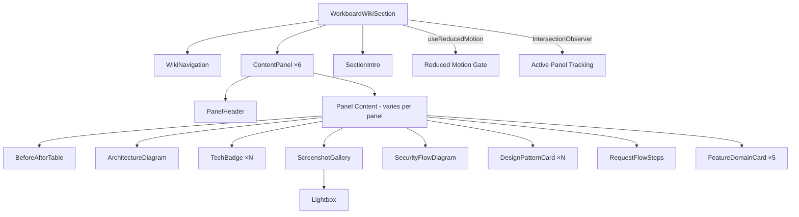
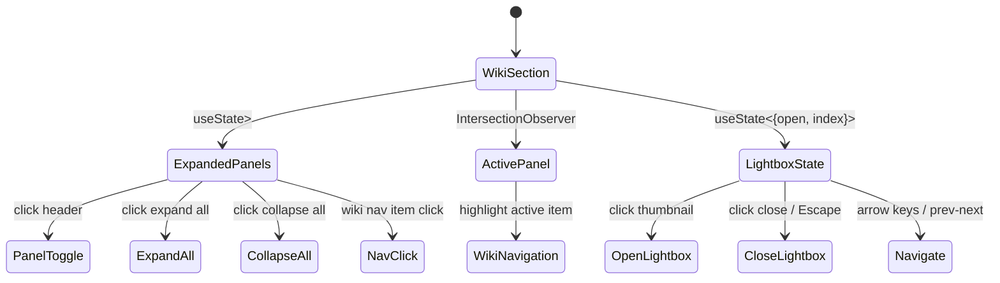

# Design Document: Workboard Wiki Section

## Overview

This design replaces the existing locked/blurred `ProjectsSection` with a rich, wiki-like navigable section showcasing the Karnataka State Police AI-Powered Data Management Platform. The section transforms a placeholder grid of blurred project cards into a structured, collapsible-panel layout with sticky sidebar navigation, curated technical content, an architecture diagram, a before/after comparison table, technology badges, a screenshot gallery with lightbox, and scroll-triggered animations.

The implementation builds on the portfolio's existing infrastructure:
- `AnimatedSection` component with `fadeUp` variant for scroll reveals
- `useReducedMotion` hook for accessible motion suppression
- `useScrollSpy` hook pattern for active-section tracking
- Tailwind CSS v4 with the coral/dark-900 theme tokens defined in `index.css`
- Framer Motion v12 for expand/collapse and micro-interactions
- `fast-check` for property-based testing

Content is curated from `public/WORKBOARD_FINAL_DOCUMENT.md`, omitting internal police operational data (officer names, badge numbers, location specifics) and focusing on technical depth: architecture decisions, security design, design patterns, and AI/LLM integration approach.

### Key Design Decisions

1. **Single component replaces `ProjectsSection`**: `WorkboardWikiSection` renders at the same position in `App.tsx` with `id="projects"` for scroll-spy compatibility. No changes to `Navbar` or other sections.
2. **Static data module over runtime markdown parsing**: Content is pre-curated into a typed TypeScript data file (`src/data/workboardData.ts`) rather than fetching/parsing the markdown at runtime. This avoids a markdown parser dependency, enables tree-shaking, and gives full type safety.
3. **Framer Motion `AnimatePresence` + `motion.div` for panel expand/collapse**: Height animation uses `animate={{ height: "auto" }}` with `overflow: hidden` for smooth expand/collapse. This avoids measuring DOM height manually.
4. **CSS `position: sticky` for sidebar navigation**: No JS scroll listener needed for the sticky behavior — pure CSS with `top` offset. Active-item highlighting uses `IntersectionObserver` via a local hook.
5. **Lazy lightbox via React state**: The lightbox overlay renders conditionally (not code-split via `React.lazy`) since it's a small component. Images use `loading="lazy"` for below-fold thumbnails.
6. **Architecture diagram as styled HTML/CSS**: Rendered as a layered block layout with Tailwind classes, not a mermaid code block or SVG. This keeps it responsive and theme-consistent.

## Architecture



### Component Tree

```
<section id="projects">                         ← WorkboardWikiSection
  <div.max-w-[1400px]>
    <AnimatedSection variant="fadeUp">
      <SectionIntro />                           ← heading + intro paragraph
    </AnimatedSection>
    <div.expand-collapse-controls />             ← Expand All / Collapse All
    <div.wiki-layout>                            ← flex row (sidebar + content)
      <WikiNavigation />                         ← sticky sidebar / mobile tabs
      <div.content-area>
        <ContentPanel id="problem-solution">     ← Problem & Solution
          <PanelHeader />
          <BeforeAfterTable />
          <CapabilitiesList />
        </ContentPanel>
        <ContentPanel id="architecture">         ← System Architecture
          <PanelHeader />
          <ArchitectureDiagram />
          <ScreenshotGallery (1 image) />
        </ContentPanel>
        <ContentPanel id="tech-stack">           ← Technology Stack
          <PanelHeader />
          <TechBadge /> ×N (grouped by category)
          <DecisionComparisonTable />
        </ContentPanel>
        <ContentPanel id="security">             ← Security Architecture
          <PanelHeader />
          <SecurityFlowDiagram />
          <RBACHierarchy />
          <SecurityLayersSummary />
        </ContentPanel>
        <ContentPanel id="design-patterns">      ← Design Patterns
          <PanelHeader />
          <DesignPatternCard /> ×11
          <ChangesTable />
          <RequestFlowSteps />
        </ContentPanel>
        <ContentPanel id="key-features">         ← Key Features & Screenshots
          <PanelHeader />
          <FeatureDomainCard /> ×5
          <ScreenshotGallery (6 images) />
        </ContentPanel>
      </div.content-area>
    </div.wiki-layout>
    <Lightbox />                                 ← conditional overlay
  </div.max-w-[1400px]>
</section>
```

### State Management



State is managed locally within `WorkboardWikiSection` — no global context needed:

- **`expandedPanels: Set<string>`** — tracks which panel IDs are currently expanded. Initialized with `new Set(["problem-solution"])` (first panel open).
- **`activePanelId: string`** — derived from `IntersectionObserver` watching panel elements. Drives the highlighted nav item.
- **`lightbox: { isOpen: boolean; currentIndex: number }`** — controls the screenshot lightbox overlay.

## Components and Interfaces

### WorkboardWikiSection (Parent)

**File:** `src/components/WorkboardWikiSection.tsx`

```typescript
// Replaces ProjectsSection in App.tsx
// Responsibilities:
// - Section layout with id="projects"
// - Manages expandedPanels state (Set<string>)
// - Manages lightbox state
// - Tracks active panel via IntersectionObserver
// - Provides expand/collapse all controls
// - Responsive layout: sidebar on lg+, tabs on <lg
```

Key behaviors:
- Renders `<section id="projects">` with `py-16 sm:py-28 px-5 sm:px-6 bg-white`
- Contains `max-w-[1400px] mx-auto` wrapper
- On initial render, `expandedPanels` = `new Set(["problem-solution"])`
- `togglePanel(id)` adds/removes from the Set
- `expandAll()` sets all 6 panel IDs; `collapseAll()` clears the Set
- Nav click: adds panel to `expandedPanels` if not present, scrolls to panel element

### WikiNavigation

**File:** `src/components/workboard/WikiNavigation.tsx`

```typescript
interface WikiNavigationProps {
  panels: PanelConfig[];
  activePanelId: string;
  onNavigate: (panelId: string) => void;
}
```

Renders:
- **Desktop (lg+):** `position: sticky; top: 6rem` sidebar, `w-64`, with vertical list of nav items
- **Mobile (<lg):** horizontal scrollable tab bar with `overflow-x: auto`, `scrollbar-hide` class
- Active item: `text-coral-500 border-l-2 border-coral-500` (desktop) or `border-b-2 border-coral-500` (mobile)
- Each item is a `<button>` with `aria-current={isActive ? "true" : undefined}`
- Keyboard navigable via Tab, activates on Enter/Space
- Visible focus ring using `focus-visible:ring-2 focus-visible:ring-coral-500`

### ContentPanel

**File:** `src/components/workboard/ContentPanel.tsx`

```typescript
interface ContentPanelProps {
  id: string;
  title: string;
  icon: React.ReactNode;
  isExpanded: boolean;
  onToggle: () => void;
  children: React.ReactNode;
  reducedMotion: boolean;
}
```

Renders:
- Outer `<div>` with `id={id}` for scroll targeting and IntersectionObserver
- `<PanelHeader>` as a `<button>` element with:
  - `aria-expanded={isExpanded}`
  - `aria-controls={id + "-content"}`
  - Icon + title text (`<h3>`) + chevron
  - Chevron rotates 180° on expand (Framer Motion `animate={{ rotate: isExpanded ? 180 : 0 }}`)
  - Hover: subtle shadow increase + coral chevron color, 200-300ms transition
- Collapsible region: `<motion.div>` with `role="region"`, `aria-labelledby={id + "-header"}`, `id={id + "-content"}`
  - Animate height: `initial={false}`, `animate={{ height: isExpanded ? "auto" : 0 }}`, `overflow: hidden`
  - Duration: 350ms, `ease: "easeOut"`
  - When `reducedMotion`: `transition={{ duration: 0 }}`
- Wrapped in `<AnimatedSection variant="fadeUp">` for scroll-triggered reveal
- Uses `card-elevated` styling on the panel container

### BeforeAfterTable

**File:** `src/components/workboard/BeforeAfterTable.tsx`

```typescript
interface BeforeAfterRow {
  area: string;
  before: string;
  after: string;
}

interface BeforeAfterTableProps {
  rows: BeforeAfterRow[];
}
```

Renders:
- **Desktop (md+):** Two-column table with "Before" (left, red-tinted) and "After" (right, green-tinted) columns
- **Mobile (<md):** Stacked cards — each row becomes a card with "Before" and "After" stacked vertically
- Header row with area labels
- Subtle background tints: `bg-red-50` for before cells, `bg-green-50` for after cells
- Semantic `<table>` on desktop, `<div>` card list on mobile (via responsive class switching)

### ArchitectureDiagram

**File:** `src/components/workboard/ArchitectureDiagram.tsx`

```typescript
// No props — renders static architecture layout
```

Renders:
- 5 horizontal layers stacked vertically: User Interface → API Gateway → Backend (Spring Boot) → AI Layer → Data Layer
- Each layer is a rounded container with a label and key components listed inside
- Connecting arrows between layers (CSS borders/pseudo-elements or small SVG arrows)
- Color coding: coral accent for AI layer, dark-900 for backend, lighter shades for UI/data
- **Desktop:** full horizontal layout with components side-by-side within each layer
- **Mobile (<md):** simplified vertical stack with abbreviated component names
- All decorative elements have `aria-hidden="true"`; a `<p>` with `sr-only` class provides a text description

### TechBadge

**File:** `src/components/workboard/TechBadge.tsx`

```typescript
interface TechBadgeProps {
  name: string;
  purpose?: string;
}
```

Renders:
- Pill shape: `rounded-full px-3 py-1.5 text-sm font-medium`
- Background: `bg-gray-100 text-dark-900` (light theme consistent)
- Hover: `scale(1.05)` transform + slightly darker background, 200ms transition
- When `reducedMotion`: no scale transform on hover
- Optional tooltip or inline text showing `purpose`

### ScreenshotGallery

**File:** `src/components/workboard/ScreenshotGallery.tsx`

```typescript
interface Screenshot {
  src: string;
  alt: string;
}

interface ScreenshotGalleryProps {
  screenshots: Screenshot[];
  onOpenLightbox: (index: number) => void;
}
```

Renders:
- Grid of thumbnail images: `grid-cols-2` (mobile <640px), `grid-cols-3` (tablet 640-1024px), `flex flex-row` (desktop >1024px)
- Each thumbnail: `<button>` wrapping ``, `rounded-xl overflow-hidden`
- Hover: `scale(1.03)` + increased shadow, 300ms transition
- Click triggers `onOpenLightbox(index)`
- Min touch target: 44×44px enforced via `min-h-[44px] min-w-[44px]`

### Lightbox

**File:** `src/components/workboard/Lightbox.tsx`

```typescript
interface LightboxProps {
  screenshots: Screenshot[];
  currentIndex: number;
  isOpen: boolean;
  onClose: () => void;
  onNavigate: (index: number) => void;
}
```

Renders:
- Fixed overlay: `fixed inset-0 z-50 bg-black/80 backdrop-blur-sm`
- Centered image with max dimensions
- Close button (top-right): `<button aria-label="Close lightbox">` with X icon
- Prev/Next buttons: `<button aria-label="Previous image">` / `<button aria-label="Next image">`
- Keyboard handling:
  - `Escape` → close
  - `ArrowLeft` → previous
  - `ArrowRight` → next
- Focus trap: on open, focus moves to close button; Tab cycles within lightbox; on close, focus returns to triggering thumbnail
- `role="dialog"`, `aria-modal="true"`, `aria-label="Screenshot gallery"`

### SecurityFlowDiagram

**File:** `src/components/workboard/SecurityFlowDiagram.tsx`

Renders the Zero Trust LLM data flow as a styled step sequence:
- Officer Input → Sanitization (PII masked) → LLM (sees tokens only) → Tool Authorization → Database Query → Results bypass LLM → Officer
- Each step is a rounded box with an icon and label
- Connecting arrows between steps
- Color-coded: red for "LLM never sees", green for "secure path"
- Responsive: horizontal on desktop, vertical on mobile

### DesignPatternCard

**File:** `src/components/workboard/DesignPatternCard.tsx`

```typescript
interface DesignPattern {
  name: string;
  location: string;
  reason: string;
}

interface DesignPatternCardProps {
  pattern: DesignPattern;
}
```

Renders:
- Compact card with pattern name (bold), location (gray), and reason (body text)
- Subtle left border accent in coral

### RequestFlowSteps

**File:** `src/components/workboard/RequestFlowSteps.tsx`

Renders the end-to-end chat command flow as a numbered step sequence:
1. User Input → 2. Authentication → 3. Language Detection → 4. NLU → 5. Sanitization → 6. LLM Call → 7. Tool Authorization → 8. Database Query → 9. Response Formatting (bypasses LLM) → 10. Audit Logging
- Horizontal scrollable on desktop, vertical timeline on mobile
- Each step: numbered circle + label + brief description

### FeatureDomainCard

**File:** `src/components/workboard/FeatureDomainCard.tsx`

```typescript
interface FeatureDomain {
  icon: string;
  title: string;
  description: string;
}

interface FeatureDomainCardProps {
  domain: FeatureDomain;
}
```

Renders:
- Icon + title + 1-2 sentence description
- Card style consistent with `card-elevated` pattern
- Compact layout for grid display

## Data Models

All data is static — no API calls or database. Content is curated from the workboard document into typed constants.

### Panel Configuration

```typescript
// src/data/workboardData.ts

export interface PanelConfig {
  id: string;
  title: string;
  icon: string; // emoji or icon identifier
}

export const PANELS: PanelConfig[] = [
  { id: 'problem-solution', title: 'Problem & Solution', icon: '🎯' },
  { id: 'architecture', title: 'System Architecture', icon: '🏗️' },
  { id: 'tech-stack', title: 'Technology Stack', icon: '⚡' },
  { id: 'security', title: 'Security Architecture', icon: '🔒' },
  { id: 'design-patterns', title: 'Design Patterns', icon: '🧩' },
  { id: 'key-features', title: 'Key Features & Screenshots', icon: '✨' },
];
```

### Before/After Data

```typescript
export interface BeforeAfterRow {
  area: string;
  before: string;
  after: string;
}

export const BEFORE_AFTER_DATA: BeforeAfterRow[] = [
  {
    area: 'Duty Rostering',
    before: 'Paper rosters, hours of manual work',
    after: 'AI generates fair schedules in seconds',
  },
  {
    area: 'Leave Requests',
    before: 'Physical letters, days to process',
    after: 'Voice or chat command — done in seconds',
  },
  {
    area: 'Daily Attendance',
    before: 'Handwritten Form 168',
    after: 'Upload form → OCR extracts → confirm → saved',
  },
  {
    area: 'Ad-hoc Assignments',
    before: 'Phone calls, no record',
    after: 'Chat command with full audit trail',
  },
  {
    area: 'Personnel Queries',
    before: 'Call someone who might know',
    after: 'Ask AI: "Who is on Guard-I today?" — instant',
  },
  {
    area: 'Audit Trail',
    before: 'None',
    after: 'Every action logged — who, what, when, why',
  },
];
```

### Technology Stack Data

```typescript
export interface TechItem {
  name: string;
  version?: string;
  purpose: string;
}

export interface TechCategory {
  category: string;
  items: TechItem[];
}

export const TECH_STACK: TechCategory[] = [
  {
    category: 'Frontend',
    items: [
      { name: 'React', version: '18.2', purpose: 'UI framework with lazy-loaded pages' },
      { name: 'TypeScript', version: '5.2', purpose: 'Type safety across frontend' },
      { name: 'Tailwind CSS', version: '3.3', purpose: 'Utility-first responsive styling' },
      { name: 'React Router', version: '6.20', purpose: 'Client-side routing with protected routes' },
      { name: 'Recharts', purpose: 'Dashboard analytics and data visualization' },
      { name: 'Leaflet', purpose: 'Interactive maps for guard locations' },
      { name: 'React Hook Form + Zod', purpose: 'Form management with schema validation' },
      { name: 'Web Speech API', purpose: 'Voice input and text-to-speech' },
    ],
  },
  {
    category: 'Backend',
    items: [
      { name: 'Java', version: '21', purpose: 'Backend language — modern features, performance' },
      { name: 'Spring Boot', version: '3.4.4', purpose: 'Application framework — web, security, data' },
      { name: 'Spring Security', version: '6.x', purpose: 'JWT auth, RBAC, ABAC enforcement' },
      { name: 'PostgreSQL', version: '16', purpose: 'Primary database with RLS policies' },
      { name: 'pgvector', purpose: 'Vector similarity search for document RAG' },
      { name: 'Resilience4j', purpose: 'Circuit breaker for AI service calls' },
      { name: 'Apache Tika + Tesseract', purpose: 'Document text extraction and OCR' },
      { name: 'Caffeine', purpose: 'In-memory caching for reference data' },
      { name: 'Flyway', purpose: 'Database migration management' },
      { name: 'Docker Compose', purpose: 'Local development environment' },
    ],
  },
  {
    category: 'AI / ML',
    items: [
      { name: 'Groq API (Llama 3.3 70B)', purpose: 'NLU, intent classification, tool selection' },
      { name: 'Ollama (all-minilm)', purpose: 'Local embeddings — data never leaves server' },
      { name: 'Web Speech API', purpose: 'Browser-native speech recognition' },
    ],
  },
];
```

### Architecture Decision Data

```typescript
export interface ArchDecision {
  decision: string;
  chosen: string;
  considered: string;
  reasoning: string;
}

export const ARCH_DECISIONS: ArchDecision[] = [
  {
    decision: 'LLM Provider',
    chosen: 'Groq (Llama 3.3 70B)',
    considered: 'OpenAI GPT-4, self-hosted Ollama',
    reasoning: 'Open-source model (no vendor lock-in), fastest inference via Groq LPU, cost-effective',
  },
  {
    decision: 'Database',
    chosen: 'PostgreSQL 16 + pgvector',
    considered: 'MySQL, MongoDB',
    reasoning: 'pgvector for RAG, Row-Level Security, JSON support for flexibility',
  },
  {
    decision: 'Embedding Strategy',
    chosen: 'Ollama (local)',
    considered: 'OpenAI embeddings',
    reasoning: 'Document content never leaves the server — privacy requirement',
  },
  {
    decision: 'Auth Mechanism',
    chosen: 'JWT (short-lived)',
    considered: 'Session cookies',
    reasoning: 'Stateless backend, works with API gateway, mobile-ready',
  },
];
```

### Design Pattern Data

```typescript
export interface DesignPattern {
  name: string;
  location: string;
  reason: string;
}

export const DESIGN_PATTERNS: DesignPattern[] = [
  { name: 'Facade', location: 'ChatService', reason: 'Single entry point for AI pipeline — simplifies controller, centralizes security' },
  { name: 'Strategy', location: 'Document parsers', reason: 'Each document type (Roster, Form 168, Platoon Chart) has its own parsing strategy' },
  { name: 'Chain of Responsibility', location: 'AI pipeline', reason: 'Input → Sanitize → NLU → Prompt → LLM → Tool → Authorize → Execute' },
  { name: 'Circuit Breaker', location: 'Groq API calls', reason: 'Prevents cascading failures when AI service is down' },
  { name: 'Repository', location: 'Spring Data JPA', reason: 'Clean data access, parameterized queries enforced' },
  { name: 'Observer', location: 'DataStore events', reason: 'UI components react to data changes without tight coupling' },
  { name: 'Token-Based Sanitization', location: 'DataSanitizerService', reason: 'LLM never sees real data — PII replaced with session-scoped tokens' },
  { name: 'Confirmation Gate', location: 'ConfirmationService', reason: 'Every write operation requires human approval' },
  { name: 'Soft Delete', location: 'All entities', reason: 'Data recovery always possible, audit trail preserved' },
  { name: 'Lazy Loading', location: 'React.lazy() pages', reason: 'Faster initial load, code-split by route' },
  { name: 'Context Pattern', location: 'React Context providers', reason: 'Global state (auth, theme, language) without prop drilling' },
];
```

### Development Changes Data

```typescript
export interface DevChange {
  original: string;
  changedTo: string;
  reason: string;
}

export const DEV_CHANGES: DevChange[] = [
  { original: 'Direct Groq calls from browser', changedTo: 'All LLM calls routed through backend', reason: 'Security — browser cannot be trusted with API keys' },
  { original: 'Single LLM for everything', changedTo: 'Groq for chat + Ollama for embeddings', reason: 'Privacy — document content stays local' },
  { original: 'Auto-execute AI suggestions', changedTo: 'Confirmation required for all writes', reason: 'Safety — no silent mutations in law enforcement system' },
];
```

### Screenshot Data

```typescript
export interface Screenshot {
  src: string;
  alt: string;
}

export const SCREENSHOTS: Screenshot[] = [
  { src: '/workboard/1.png', alt: 'AI-powered dashboard showing personnel overview and section metrics' },
  { src: '/workboard/2.png', alt: 'Natural language chat interface for duty management commands' },
  { src: '/workboard/3.png', alt: 'Duty roster calendar with platoon rotation schedule' },
  { src: '/workboard/4.png', alt: 'Personnel management view with rank hierarchy and status tracking' },
  { src: '/workboard/5.png', alt: 'Leave management interface with balance tracking and approval workflow' },
  { src: '/workboard/6.png', alt: 'Security audit trail showing logged actions with source tracking' },
];
```

### Feature Domain Data

```typescript
export interface FeatureDomain {
  icon: string;
  title: string;
  description: string;
}

export const FEATURE_DOMAINS: FeatureDomain[] = [
  {
    icon: '👥',
    title: 'Personnel Management',
    description: '572+ personnel across 3 sections with rank hierarchy, badge-based identification, and real-time status tracking (active, on-leave, training, suspended).',
  },
  {
    icon: '📋',
    title: 'Duty Management',
    description: '15-day platoon rotation across 22 guard locations with shift management, VIP escorts, and ad-hoc assignments — all with full audit trail.',
  },
  {
    icon: '🤖',
    title: 'AI-Powered Features',
    description: 'Natural language chat in English and Kannada, voice commands, document OCR with structured data extraction, and AI-generated fair duty schedules.',
  },
  {
    icon: '🏖️',
    title: 'Leave Management',
    description: '11 leave types with balance tracking, carry-forward rules, duty conflict detection, and rank-based approval workflow.',
  },
  {
    icon: '🔐',
    title: 'Security & Compliance',
    description: 'Zero Trust LLM architecture — PII never reaches the AI. JWT auth, RBAC + ABAC at every layer, immutable audit trail, AES-256 encryption at rest.',
  },
];
```

### Security Layers Data

```typescript
export const SECURITY_LAYERS: string[] = [
  'TLS 1.3 everywhere',
  'JWT auth (30-min access, 7-day refresh)',
  'RBAC (rank hierarchy) + ABAC (section, ownership)',
  'PII masking before LLM',
  'Parameterized queries only',
  'Confirmation gates for all writes',
  'Immutable append-only audit logs',
  'AES-256 encryption at rest',
  'Soft delete policy — no physical deletes',
];
```

### RBAC Hierarchy Data

```typescript
export const RBAC_HIERARCHY: { rank: string; access: string }[] = [
  { rank: 'DCP', access: 'Full access — all sections, all personnel, soft delete' },
  { rank: 'ACP', access: 'All sections — edit own section subordinates' },
  { rank: 'RPI', access: 'Own section + reports — approve RSI and below' },
  { rank: 'RSI', access: 'Own section — approve ARSI and below' },
  { rank: 'ARSI', access: 'View AHC + APC in section' },
  { rank: 'AHC', access: 'View APC + own data' },
  { rank: 'APC', access: 'Own data only' },
];
```


## Correctness Properties

*A property is a characteristic or behavior that should hold true across all valid executions of a system — essentially, a formal statement about what the system should do. Properties serve as the bridge between human-readable specifications and machine-verifiable correctness guarantees.*

### Property 1: Expand all / collapse all toggles every panel

*For any* initial set of expanded panel IDs (a subset of the 6 panel IDs), calling `expandAll` SHALL result in all 6 panels being in the expanded set, and subsequently calling `collapseAll` SHALL result in an empty expanded set.

**Validates: Requirements 2.6**

### Property 2: WikiNavigation renders all panel titles and highlights the active one

*For any* array of `PanelConfig` objects (each with a non-empty `id` and `title`) and *for any* `activePanelId` that is one of those IDs, the rendered `WikiNavigation` SHALL contain every panel title as a clickable element, and exactly the item matching `activePanelId` SHALL have the active styling indicator (coral-500 accent).

**Validates: Requirements 3.1, 3.3, 3.6**

### Property 3: Navigation click expands a collapsed panel

*For any* panel ID that is NOT in the current `expandedPanels` set, clicking the corresponding `WikiNavigation` item SHALL add that panel ID to the `expandedPanels` set (the panel becomes expanded).

**Validates: Requirements 3.2**

### Property 4: BeforeAfterTable renders all row data

*For any* array of `BeforeAfterRow` objects (each with non-empty `area`, `before`, and `after` strings), the rendered `BeforeAfterTable` SHALL contain every `area`, `before`, and `after` value in the output.

**Validates: Requirements 4.2, 4.3**

### Property 5: TechBadge renders category headings and all technology names

*For any* array of `TechCategory` objects (each with a non-empty `category` string and a non-empty `items` array of `TechItem` objects with non-empty `name` strings), the rendered tech stack section SHALL contain every category name as a heading and every technology name as a badge element.

**Validates: Requirements 6.1, 6.2**

### Property 6: DesignPatternCard renders name, location, and reason

*For any* `DesignPattern` object with non-empty `name`, `location`, and `reason` strings, the rendered `DesignPatternCard` SHALL contain all three values in its output.

**Validates: Requirements 8.1, 8.2**

### Property 7: FeatureDomainCard renders icon, title, and description

*For any* `FeatureDomain` object with non-empty `icon`, `title`, and `description` strings, the rendered `FeatureDomainCard` SHALL contain the title and description in its output, and the icon SHALL be present.

**Validates: Requirements 9.1, 9.2**

### Property 8: ScreenshotGallery renders all images with src, alt, and lazy loading

*For any* non-empty array of `Screenshot` objects (each with non-empty `src` and `alt` strings), the rendered `ScreenshotGallery` SHALL produce one `` element per screenshot, each with the correct `src`, a non-empty `alt` attribute matching the screenshot's alt text, and `loading="lazy"`.

**Validates: Requirements 9.3, 9.6, 14.1**

### Property 9: Thumbnail click triggers lightbox with correct index

*For any* valid index `i` within a `Screenshot` array, clicking the thumbnail at position `i` SHALL call `onOpenLightbox` with the value `i`.

**Validates: Requirements 9.4**

### Property 10: Lightbox keyboard navigation

*For any* `currentIndex` and `screenshots` array of length ≥ 2, pressing `ArrowRight` SHALL call `onNavigate` with `(currentIndex + 1) % length`, pressing `ArrowLeft` SHALL call `onNavigate` with `(currentIndex - 1 + length) % length`, and pressing `Escape` SHALL call `onClose`.

**Validates: Requirements 9.5**

### Property 11: ContentPanel accessibility attributes match expanded state

*For any* panel `id` string and *for any* boolean `isExpanded` value, the rendered `ContentPanel` SHALL have a `<button>` with `aria-expanded` equal to the string representation of `isExpanded`, and the collapsible region SHALL have `role="region"` and `aria-labelledby` referencing the header button's `id`.

**Validates: Requirements 13.2, 13.3**

## Error Handling

This feature is a self-contained UI section with no external API calls, database operations, or user input processing. All content is static and hardcoded. Error scenarios are minimal:

| Scenario | Handling |
|---|---|
| Screenshot image fails to load | `` shows alt text naturally. No broken layout — thumbnails have fixed aspect ratio via CSS. |
| `useReducedMotion` hook fails (SSR or missing `window.matchMedia`) | Hook returns `false` as default — animations proceed normally. |
| Framer Motion `AnimatePresence` with height="auto" | Known FM pattern — works reliably. Fallback: content renders expanded without animation. |
| `IntersectionObserver` not supported (very old browsers) | Active panel tracking degrades gracefully — no nav highlighting, but panels still work. |
| Panel ID mismatch between data and DOM | TypeScript enforces consistent IDs via the `PanelConfig` type. Data is hardcoded, not user-supplied. |
| Lightbox opened with invalid index | Guard clause clamps index to `[0, screenshots.length - 1]`. |
| Focus trap in lightbox fails | Lightbox still closable via close button click and Escape key. |
| `backdrop-filter` not supported | Lightbox overlay degrades to solid dark background — functional, just less polished. |

No try/catch blocks or error boundaries are needed. All failure modes degrade gracefully to static content.

## Testing Strategy

### Unit Tests (Example-Based)

Focus on concrete rendering checks, specific content verification, and conditional behavior:

- **WorkboardWikiSection rendering**: Verify `id="projects"`, `section` element, `h2` heading with font-heading class, intro paragraph with "Karnataka State Police", `max-w-[1400px]` wrapper
- **No locked UI remnants**: Verify no blur overlay, no lock icon SVG, no "Section Locked" text
- **Initial panel state**: Verify first panel ("Problem & Solution") is expanded, remaining 5 are collapsed
- **Panel toggle**: Click a PanelHeader, verify panel toggles between expanded and collapsed
- **Expand/collapse all buttons**: Click expand all, verify all 6 panels expanded. Click collapse all, verify all collapsed.
- **WikiNavigation desktop layout**: Verify sticky sidebar classes on lg+ viewport
- **WikiNavigation mobile layout**: Verify horizontal scrollable tab bar classes on <lg viewport
- **BeforeAfterTable responsive**: Verify table layout on md+, stacked cards on <md
- **ArchitectureDiagram**: Verify 5 layer labels present, no mermaid code blocks, `aria-hidden` on decorative elements
- **Tech stack content**: Verify all required frontend, backend, and AI/ML technologies present in rendered output
- **Security content**: Verify "Zero Trust", PII masking terms, RBAC hierarchy, security layers summary
- **Design patterns content**: Verify all 11 pattern names, at least 3 development changes, request flow steps
- **Key features content**: Verify 5 feature domain titles
- **Screenshot gallery grid**: Verify responsive grid classes (grid-cols-2, sm:grid-cols-3)
- **Lightbox focus management**: Open lightbox, verify focus on close button. Close, verify focus returns.
- **Lightbox dialog attributes**: Verify `role="dialog"`, `aria-modal="true"`, `aria-label`
- **Semantic HTML**: Verify `section`, `h2`, `h3`, `button` elements used correctly
- **AnimatedSection usage**: Verify AnimatedSection wraps content panels with `variant="fadeUp"`
- **Reduced motion**: With `prefers-reduced-motion: reduce`, verify animations suppressed
- **Touch targets**: Verify min-h-[44px] min-w-[44px] on interactive elements

### Property-Based Tests

Using `fast-check` (already in devDependencies). Minimum 100 iterations per property.

| Property | Test Description | Tag |
|---|---|---|
| Property 1 | Generate random subsets of 6 panel IDs as initial expanded state. Apply expandAll, assert all 6 in set. Apply collapseAll, assert empty set. | `Feature: workboard-wiki-section, Property 1: Expand all / collapse all toggles every panel` |
| Property 2 | Generate random PanelConfig arrays (1-10 items, non-empty id/title). Pick random activePanelId. Render WikiNavigation, assert all titles present and only active item highlighted. | `Feature: workboard-wiki-section, Property 2: WikiNavigation renders all panel titles and highlights the active one` |
| Property 3 | Generate random panel ID not in current expandedPanels set. Simulate nav click, assert panel ID added to set. | `Feature: workboard-wiki-section, Property 3: Navigation click expands a collapsed panel` |
| Property 4 | Generate random BeforeAfterRow arrays (1-20 items, non-empty strings). Render BeforeAfterTable, assert all area/before/after strings in DOM. | `Feature: workboard-wiki-section, Property 4: BeforeAfterTable renders all row data` |
| Property 5 | Generate random TechCategory arrays (1-5 categories, 1-10 items each). Render tech stack section, assert all category names and tech names present. | `Feature: workboard-wiki-section, Property 5: TechBadge renders category headings and all technology names` |
| Property 6 | Generate random DesignPattern objects (non-empty name/location/reason). Render DesignPatternCard, assert all three strings in output. | `Feature: workboard-wiki-section, Property 6: DesignPatternCard renders name, location, and reason` |
| Property 7 | Generate random FeatureDomain objects (non-empty icon/title/description). Render FeatureDomainCard, assert title and description in output. | `Feature: workboard-wiki-section, Property 7: FeatureDomainCard renders icon, title, and description` |
| Property 8 | Generate random Screenshot arrays (1-10 items, non-empty src/alt). Render ScreenshotGallery, assert one img per screenshot with correct src, alt, and loading="lazy". | `Feature: workboard-wiki-section, Property 8: ScreenshotGallery renders all images with src, alt, and lazy loading` |
| Property 9 | Generate random index within screenshots array bounds. Simulate click on thumbnail at that index, assert onOpenLightbox called with that index. | `Feature: workboard-wiki-section, Property 9: Thumbnail click triggers lightbox with correct index` |
| Property 10 | Generate random currentIndex (0 to length-1) and array length (2-20). Simulate ArrowRight, assert onNavigate called with (currentIndex+1)%length. Simulate ArrowLeft, assert (currentIndex-1+length)%length. Simulate Escape, assert onClose called. | `Feature: workboard-wiki-section, Property 10: Lightbox keyboard navigation` |
| Property 11 | Generate random panel ID string and random boolean isExpanded. Render ContentPanel, assert button has aria-expanded matching boolean, region has role="region" and aria-labelledby referencing header ID. | `Feature: workboard-wiki-section, Property 11: ContentPanel accessibility attributes match expanded state` |

### What Is NOT Tested

- Visual appearance (color accuracy, spacing, typography aesthetics) — requires manual review or visual regression tools
- Responsive breakpoint behavior at exact pixel boundaries — requires real viewport simulation (Playwright/Cypress)
- Animation timing, easing curves, and smoothness — requires animation timeline inspection
- Scroll-triggered AnimatedSection reveal sequencing — tightly coupled to Framer Motion + IntersectionObserver internals
- CLS and performance metrics — requires Lighthouse or real browser profiling
- WCAG AA contrast ratios — requires color contrast calculation tools
- Sticky sidebar scroll behavior — requires real scroll simulation
- Focus trap completeness in lightbox — requires full keyboard interaction testing (Playwright)
