# Karnataka State Police — CAR MT Section
# AI-Powered Intelligent Data Management Platform

**Project Documentation**

**Classification:** Internal — Karnataka State Police CAR MT Section
**Version:** 1.0 | April 2026

---

## Table of Contents

1. [Problem Statement](#1-problem-statement)
2. [Current Behaviour (Before)](#2-current-behaviour-before)
3. [Solution We Provided](#3-solution-we-provided)
4. [System Architecture](#4-system-architecture)
5. [Technology Stack](#5-technology-stack)
6. [Why LLMs and AI?](#6-why-llms-and-ai)
7. [Is AI Necessary Here?](#7-is-ai-necessary-here)
8. [LLM Trade-offs](#8-llm-trade-offs)
9. [Security Architecture](#9-security-architecture)
10. [Design Patterns and Architecture Decisions](#10-design-patterns-and-architecture-decisions)
11. [End-to-End Request Flow — Chat Command Example](#11-end-to-end-request-flow--chat-command-example)
12. [Database Design](#12-database-design)
13. [Key Features Summary](#13-key-features-summary)

---

## 1. Problem Statement

The Karnataka State Police CAR (City Armed Reserve) MT Section manages **572 active personnel** across three operational sections, plus 111 personnel on training and 24 recruit APCs. Every day, officers must be assigned to guard duties across 22 locations, VIP escorts, check posts (3 shifts), striking force teams, court duties, cash escorts, and prison escorts — all following a strict 15-day platoon rotation cycle.

The core problems:

- **Manual duty rostering** — Section heads create duty rosters on paper or basic spreadsheets. A single change (leave, transfer, emergency) cascades into hours of manual re-planning.
- **Paper-based leave management** — Leave applications travel as physical letters through a chain of command. Tracking leave balances across 11 leave types (EL, CL, HPL, PL, CML, RH, SCL, ML, CCL, EOL, PERM) is error-prone.
- **No real-time visibility** — There is no single source of truth for "who is on duty right now." Officers call each other to find out.
- **Form 168 is handwritten daily** — The daily duty tracking form is filled by hand, making historical queries nearly impossible.
- **Document chaos** — Platoon charts, strength statements, and rosters exist as scanned PDFs and photocopies. Extracting data from them requires manual reading.
- **Ad-hoc requests are verbal** — Urgent duty assignments (protests, VIP movements, festivals) are communicated through phone calls with no audit trail.
- **No accountability trail** — When something goes wrong, there is no record of who assigned whom, when, or why.

---

## 2. Current Behaviour (Before)

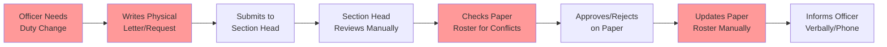

| Area | How It Works Today | Pain Point |
|------|-------------------|------------|
| Duty Rostering | Paper rosters, spreadsheets | Hours to create, cascading changes on any modification |
| Leave Requests | Physical letters through chain of command | Days to process, no balance tracking, lost paperwork |
| Daily Attendance (Form 168) | Handwritten daily | Cannot query history, no analytics |
| Ad-hoc Assignments | Phone calls, verbal orders | No audit trail, miscommunication |
| Platoon Rotation | Manual 15-day cycle tracking | Errors in rotation, unfair distribution |
| Strength Reporting | Manual counting from registers | Outdated by the time it is compiled |
| Document Management | Scanned PDFs, photocopies | Cannot search or extract data |
| Personnel Queries | Call someone who might know | Slow, unreliable, no single source of truth |

---

## 3. Solution We Provided

We built an **AI-powered digital workboard** that replaces every manual process with a unified platform. Officers interact through a web interface, voice commands, or document uploads — and the system handles the rest.

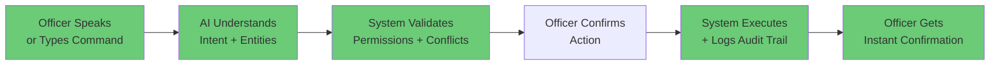

### What Changed

| Area | Before | After |
|------|--------|-------|
| Duty Rostering | Paper, hours of work | AI generates fair schedules in seconds, respecting all rules |
| Leave Requests | Physical letters, days to process | Type or say "Apply 5 days EL for AHC 2573" — done in seconds |
| Daily Attendance | Handwritten Form 168 | Upload the form → OCR extracts data → officer confirms → saved |
| Ad-hoc Assignments | Phone calls | Create via chat or voice with full audit trail |
| Platoon Rotation | Manual tracking | Automated 15-day rotation engine with conflict detection |
| Strength Reporting | Manual counting | Real-time dashboard with sanctioned vs actual vs vacancy |
| Document Management | Scanned PDFs | Upload → OCR → structured data extraction → searchable |
| Personnel Queries | Call someone | Ask the AI: "Who is on Guard-I today?" — instant answer |
| Audit Trail | None | Every action logged — who, what, when, from where, why |

### Key Capabilities

- **Natural Language Chat** — Officers type or speak commands in English or Kannada. The AI understands intent and executes actions.
- **Voice Commands** — Speak to create leave requests, assign duties, query personnel, or check schedules.
- **Document Intelligence** — Upload scanned rosters, Form 168, platoon charts. The system extracts structured data using OCR.
- **AI-Powered Scheduling** — Generates fair duty rosters respecting rotation rules, rest periods, leave, and preferences.
- **Role-Based Access** — Rank hierarchy (DCP > ACP > RPI > RSI > ARSI > AHC > APC) enforced at every level.
- **Complete Audit Trail** — Every action logged with source (voice, document, manual), user, timestamp, and before/after values.

---

## 4. System Architecture

### High-Level Architecture

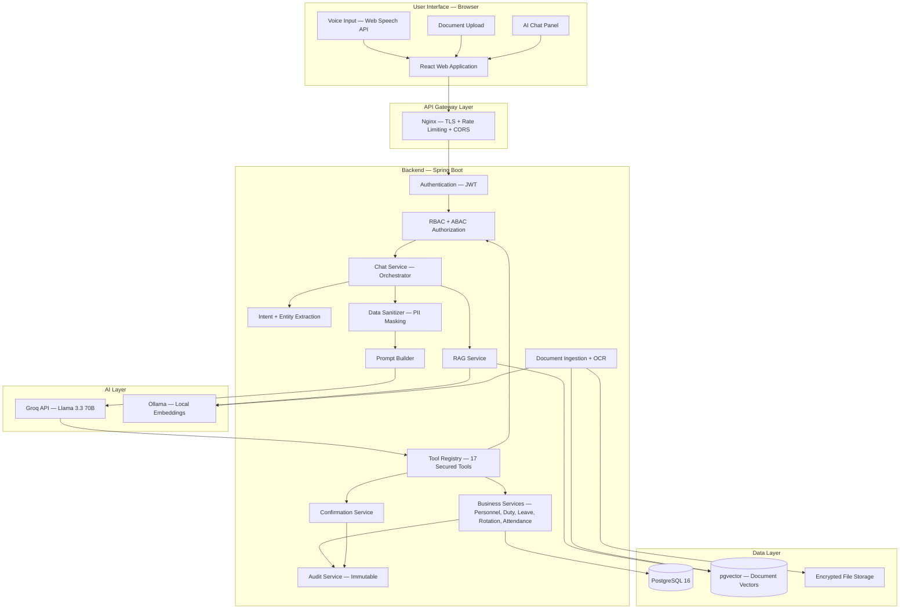

### Frontend Architecture

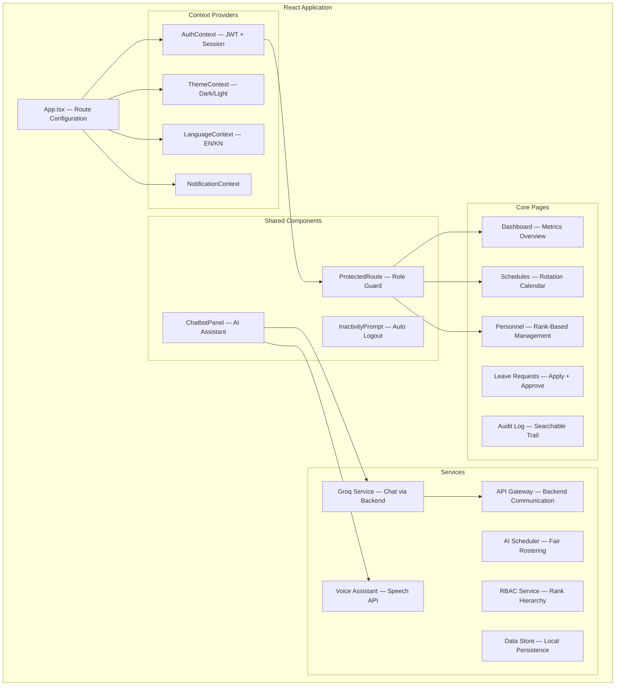

### Backend Service Architecture

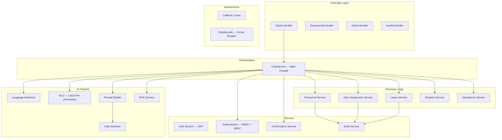

---

## 5. Technology Stack

### Frontend

| Technology | Version | Purpose |
|-----------|---------|---------|
| React | 18.2 | UI framework — component-based, lazy-loaded pages |
| TypeScript | 5.2 | Type safety across the entire frontend |
| Tailwind CSS | 3.3 | Utility-first styling, responsive design |
| React Router | 6.20 | Client-side routing with protected routes |
| Recharts | 2.10 | Dashboard analytics and data visualization |
| Leaflet + React Leaflet | 1.9 / 5.0 | Interactive maps for guard locations |
| React Hook Form + Zod | 7.48 / 3.22 | Form management with schema validation |
| Web Speech API | Browser Native | Voice input (speech-to-text) and output (text-to-speech) |

### Backend

| Technology | Version | Purpose |
|-----------|---------|---------|
| Java | 21 (LTS) | Backend language — modern features, performance |
| Spring Boot | 3.4.4 | Application framework — web, security, data, cache |
| Spring Security | 6.x | JWT authentication, RBAC, ABAC enforcement |
| Spring Data JPA | 3.x | Database access — parameterized queries only |
| PostgreSQL | 16 | Primary database — business data, RLS policies |
| pgvector | Extension | Vector similarity search for document RAG |
| Resilience4j | 2.2 | Circuit breaker, retry, bulkhead for AI service calls |
| Apache Tika | 3.0 | Document text extraction (PDF, DOCX) |
| Tesseract | Via Tika | OCR for scanned images — English + Kannada |
| Caffeine | 3.1 | In-memory caching for reference data |
| Flyway | Included | Database migration management |
| JJWT | 0.12.6 | JWT token generation and validation |
| Docker Compose | Latest | Local development environment (PostgreSQL + pgvector) |
| Gradle | 8.x | Build system |

### AI / ML

| Technology | Purpose | Where It Runs |
|-----------|---------|---------------|
| Groq API (Llama 3.3 70B) | Natural language understanding, intent classification, tool selection | External API — data is sanitized before sending |
| Ollama (all-minilm) | Document embedding generation for RAG | Local server — data never leaves the network |
| Web Speech API | Browser-native speech recognition and synthesis | Client browser — no external service |

---

## 6. Why LLMs and AI?

### The Problem with Traditional Approaches

A traditional CRUD application could handle duty assignments, leave requests, and personnel management. But it would require officers to:

1. Navigate through multiple screens to find information
2. Fill out structured forms for every action
3. Learn the application's specific workflow
4. Type exact search queries to find personnel or duties

### What AI Brings to This System

```mermaid
flowchart TD
    subgraph "Without AI"
        A1[Officer opens app] --> A2[Navigates to Leave page]
        A2 --> A3[Clicks 'New Request']
        A3 --> A4[Fills form: employee, type, dates, reason]
        A4 --> A5[Submits]
        A5 --> A6[Checks for conflicts manually]
    end

    subgraph "With AI"
        B1["Officer says: 'Apply 5 days EL\nfor AHC 2573 from April 1'"] --> B2[AI extracts: employee, type, dates]
        B2 --> B3[System checks conflicts automatically]
        B3 --> B4[Officer confirms with one click]
    end

    style A1 fill:#ff9999
    style A2 fill:#ff9999
    style A3 fill:#ff9999
    style A4 fill:#ff9999
    style B1 fill:#6bcb77
    style B2 fill:#6bcb77
    style B4 fill:#6bcb77
```

| Capability | Why AI is the Right Fit |
|-----------|------------------------|
| Natural Language Commands | Officers speak in their natural language (English or Kannada). No training needed. "Who is on Guard-I today?" is faster than navigating 3 screens. |
| Voice-First Interface | Field officers may not have time to type. Voice commands while on duty are practical. |
| Document Intelligence | Hundreds of existing paper forms need digitization. OCR + AI parsing converts them to structured data in minutes instead of hours of manual entry. |
| Intent Understanding | "Show me Vasantha's schedule" and "What duty is AHC 2573 on?" mean the same thing. AI handles this naturally. |
| Ad-hoc Query Flexibility | Officers ask questions the system wasn't explicitly designed for. AI can interpret and route to the right data. |
| Multilingual Support | Kannada-speaking officers can interact in their native language without translation overhead. |

### What AI Does NOT Do in This System

- AI does NOT make decisions — it only understands requests and suggests actions
- AI does NOT have direct database access — it requests tool execution, which is authorized separately
- AI does NOT see real personnel data — all PII is masked before the LLM processes it
- AI does NOT auto-execute write operations — every mutation requires human confirmation

---

## 7. Is AI Necessary Here?

**Short answer: Yes, but with clear boundaries.**

### Where AI is Essential

| Use Case | Without AI | With AI | Verdict |
|----------|-----------|---------|---------|
| Voice commands in the field | Not possible | Officers speak naturally | Essential |
| Document OCR + parsing | Manual data entry (hours) | Upload → extract → confirm (minutes) | Essential |
| Natural language queries | Rigid search forms | "Who is absent today?" | High value |
| Multilingual interaction | Separate UI per language | Speak in Kannada, get Kannada response | High value |
| Ad-hoc duty requests | Phone calls, no trail | Chat command with full audit | High value |

### Where AI is Optional (But Adds Value)

| Use Case | Traditional Alternative | AI Advantage |
|----------|----------------------|--------------|
| Leave request creation | Fill a form | Faster via voice, but form works too |
| Schedule viewing | Navigate to calendar page | "Show my schedule" is convenient, not essential |
| Personnel lookup | Search bar with filters | Natural language is easier but search works |

### Our Approach: AI as an Accelerator, Not a Dependency

The system is designed so that **every operation can be performed without AI**. The traditional UI (forms, tables, buttons) is fully functional. AI is layered on top as an accelerator:

- If Groq API is down → officers use the regular UI
- If voice recognition fails → officers type their command
- If OCR misreads a document → officers correct it in the review screen

**AI reduces a 10-step process to 2 steps. But the 10-step process still works.**

---

## 8. LLM Trade-offs

### Why Groq + Llama 3.3 70B?

| Factor | Groq (Llama 3.3 70B) | Self-Hosted Ollama | OpenAI GPT-4 |
|--------|----------------------|-------------------|---------------|
| Speed | Very fast (Groq's LPU hardware) | Slower (depends on GPU) | Moderate |
| Cost | Free tier available, paid for production | Hardware cost only | Expensive per token |
| Data Privacy | Data sent to Groq servers (we sanitize first) | Data stays local | Data sent to OpenAI |
| Multilingual (Kannada) | Good with 70B model | Depends on model | Excellent |
| Tool Calling | Supported | Supported | Excellent |
| Availability | 99.9% SLA on paid tier | Depends on your infra | 99.9% SLA |
| Vendor Lock-in | Low (Llama is open-source) | None | High |

### Why Not Fully Self-Hosted?

We use Ollama locally for embeddings (document vectors never leave the server). For the main LLM, we chose Groq because:

1. **70B model quality** — The 70B parameter model handles Kannada and complex intent recognition far better than smaller models we could self-host
2. **No GPU investment** — Self-hosting 70B requires expensive GPU infrastructure
3. **We sanitize everything** — Since we mask all PII before sending to Groq, the privacy risk is near zero

### Trade-off Summary

| Trade-off | Our Decision | Reasoning |
|-----------|-------------|-----------|
| Speed vs Cost | Groq free tier for dev, paid for production | Groq's LPU is the fastest inference available |
| Privacy vs Quality | Sanitize data + use external LLM | 70B quality is worth it when data is anonymized |
| Local vs Cloud LLM | Cloud for inference, local for embeddings | Best of both worlds — quality + privacy |
| Single LLM vs Multiple | Groq for chat, Ollama for embeddings | Each tool for its strength |
| Streaming vs Batch | Batch responses (streaming planned) | Simpler initial implementation |

### LLM Limitations We Designed Around

| Limitation | How We Handle It |
|-----------|-----------------|
| LLM can hallucinate | LLM only selects tools and parameters — actual data comes from the database |
| LLM can be prompt-injected | Input sanitization + Java-level authorization (LLM cannot bypass security) |
| LLM adds latency | 40-60% of commands resolved locally without LLM call |
| LLM has rate limits | Circuit breaker + graceful fallback to manual UI |
| LLM may mix languages | Strong system prompt + Unicode validation + retry on mismatch |

---

## 9. Security Architecture

### Zero Trust with LLM — Core Principle

The LLM is treated as an **untrusted external service**. It never sees real data. It never executes actions directly. It only understands intent and suggests tool calls.

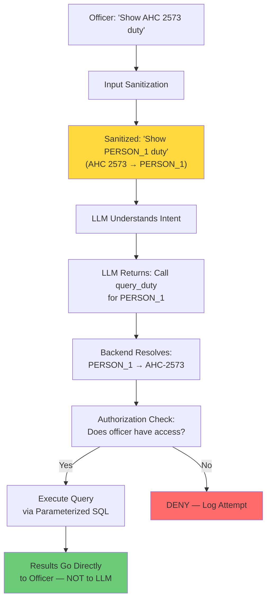

### What the LLM Sees vs What Actually Happens

| Data Type | Sent to LLM? | How It Is Handled |
|-----------|-------------|-------------------|
| Officer's natural language query | Yes — sanitized | SQL-like patterns stripped, escape characters removed |
| Personnel names | Never | Replaced with tokens (PERSON_1, PERSON_2) |
| Badge numbers | Never | Replaced with tokens (BADGE_1) |
| Phone numbers | Never | Completely removed |
| Query results | Never | Results go directly from database to officer |
| Document content | Never sent to Groq | OCR and parsing happen locally via Ollama |

### Authentication Flow

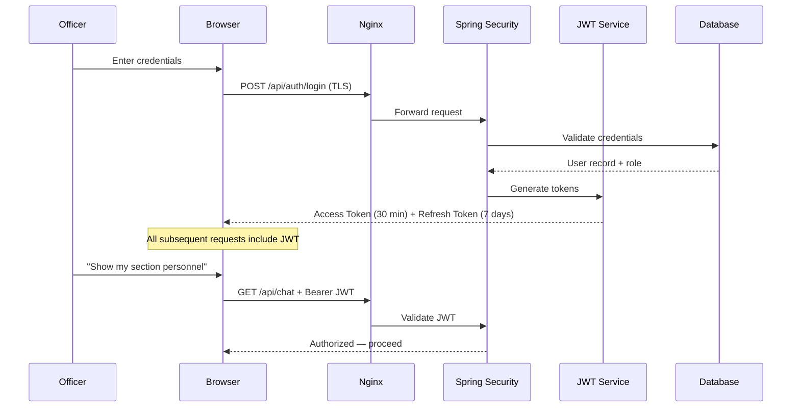

### Role-Based Access Control (RBAC)

The system enforces the Karnataka Police rank hierarchy at every level:

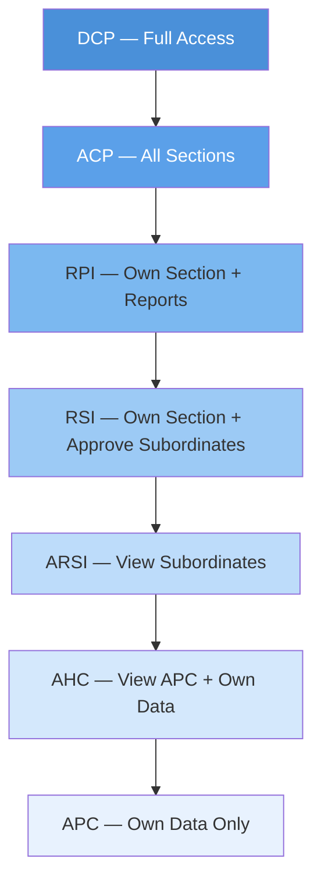

| Role | Can View | Can Edit | Can Delete | Can Approve Leave |
|------|----------|----------|------------|-------------------|
| DCP (Admin) | All sections, all personnel | All records | Soft delete (with double confirm) | All personnel |
| ACP (Supervisor) | All sections | Own section subordinates | No | Own section |
| RPI | Own section + reports | Own section subordinates | No | RSI and below |
| RSI | Own section | ARSI and below | No | ARSI and below |
| ARSI | AHC + APC in section | No | No | No |
| AHC | APC + own data | No | No | No |
| APC | Own data only | No | No | No |

### Tool-Level Authorization

Every tool the LLM can request has its own permission check:

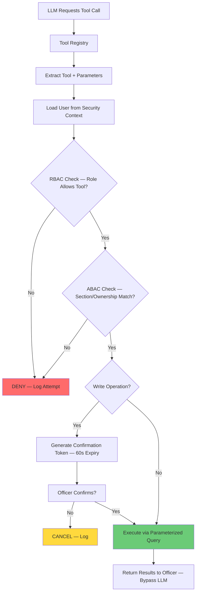

### Security Measures Summary

| Layer | Protection |
|-------|-----------|
| Transport | TLS 1.3 everywhere |
| Authentication | JWT (30-min access, 7-day refresh), SCRAM-SHA-256 for DB |
| Authorization | RBAC (rank hierarchy) + ABAC (section, ownership, time-based) |
| LLM Security | PII masking, results bypass LLM, tool authorization at Java layer |
| Prompt Injection | Input sanitization, hardened system prompt, LLM cannot execute directly |
| Database | Row-Level Security, parameterized queries only, no raw SQL |
| Write Operations | Confirmation required, 60-second token expiry |
| Audit | Immutable append-only logs, separate schema, external SIEM in production |
| Data at Rest | AES-256 for PII columns, encrypted file storage, encrypted backups |
| Soft Delete | No physical deletes — all records recoverable |
| Inactivity | Auto-logout after 10 minutes with 2-minute warning |

### Security Example — Leave Request via Voice

Here is exactly what happens when an officer says "Apply 5 days EL for AHC 2573 from April 1":

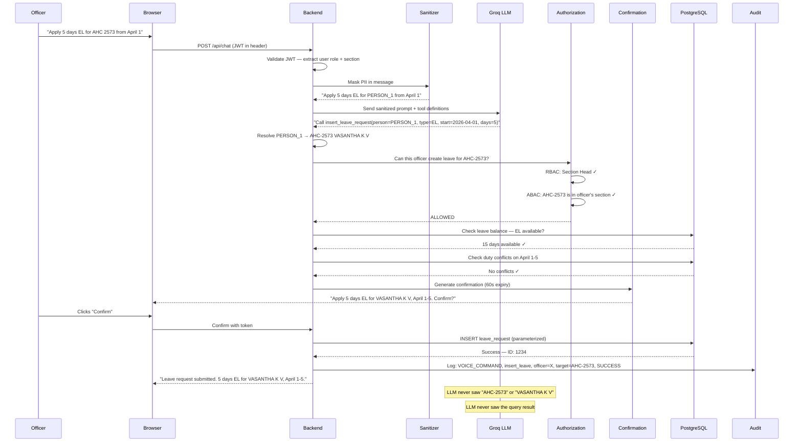

---

## 10. Design Patterns and Architecture Decisions

### Patterns Used

| Pattern | Where | Why |
|---------|-------|-----|
| Facade Pattern | ChatService orchestrates all AI pipeline services | Single entry point for chat — simplifies controller, centralizes security |
| Strategy Pattern | Document parsers (Roster, Form 168, Platoon Chart) | Each document type has its own parsing strategy, selected at runtime |
| Chain of Responsibility | Input → Sanitize → NLU → Prompt → LLM → Tool → Authorize → Execute | Each step processes and passes to the next, can short-circuit |
| Circuit Breaker | Groq API calls via Resilience4j | Prevents cascading failures when AI service is down |
| Repository Pattern | Spring Data JPA repositories | Clean data access layer, parameterized queries enforced |
| Observer Pattern | DataStore dispatches custom events on changes | UI components react to data changes without tight coupling |
| Token-Based Sanitization | DataSanitizerService replaces PII with session-scoped tokens | LLM never sees real data, tokens resolved after LLM responds |
| Confirmation Gate | ConfirmationService for all write operations | No silent mutations — every write requires human approval |
| Soft Delete | All entities use status flags instead of physical deletion | Data recovery always possible, audit trail preserved |
| Lazy Loading | React.lazy() for all page components | Faster initial load, code-split by route |
| Context Pattern | React Context for auth, theme, language, notifications | Global state without prop drilling |

### Architecture Decisions — Why We Made Them

| Decision | What We Chose | What We Considered | Why This Choice |
|----------|--------------|-------------------|-----------------|
| Frontend Framework | React + TypeScript | Angular, Vue | React's ecosystem, TypeScript for safety, team expertise |
| Backend Framework | Spring Boot 3.4 | Node.js, Django | Java 21 performance, Spring Security maturity, enterprise-grade |
| Database | PostgreSQL 16 + pgvector | MySQL, MongoDB | pgvector for RAG, RLS for security, JSON support for flexibility |
| LLM Provider | Groq (Llama 3.3 70B) | OpenAI, self-hosted | Open-source model (no vendor lock-in), Groq speed, cost-effective |
| Embedding Model | Ollama (local) | OpenAI embeddings | Document content never leaves the server — privacy requirement |
| Auth Mechanism | JWT (short-lived) | Session cookies | Stateless backend, works with API gateway, mobile-ready |
| State Management | React Context | Redux, Zustand | Sufficient for this app's complexity, no extra dependency |
| Styling | Tailwind CSS | CSS Modules, Styled Components | Rapid development, consistent design, small bundle |
| Build Tool | Vite | Webpack, CRA | Faster dev server, better HMR, modern defaults |
| OCR Engine | Apache Tika + Tesseract | Google Vision, AWS Textract | Runs locally (no cloud dependency), supports Kannada |
| Caching | Caffeine (in-memory) | Redis | Sufficient for single-instance deployment, no infra overhead |
| Resilience | Resilience4j | Hystrix, custom | Spring Boot 3 native support, active maintenance |

### What Changed During Development

| Original Plan | What We Changed To | Why |
|--------------|-------------------|-----|
| Direct Groq calls from browser | All LLM calls routed through backend | Security — browser cannot be trusted with API keys or raw data |
| Single LLM for everything | Groq for chat + Ollama for embeddings | Privacy — document content stays local |
| Auto-execute AI suggestions | Confirmation required for all writes | Safety — no silent mutations in law enforcement system |
| Mock LLM for demo | Real Groq integration with mock fallback | Production readiness while keeping demo capability |
| Simple role check | Full RBAC + ABAC + tool-level authorization | Law enforcement data requires granular access control |

---

## 11. End-to-End Request Flow — Chat Command Example

This section traces a complete request from the moment an officer types a command to the moment they see the result.

### Scenario: Officer types "Who is on Guard-I duty today?"

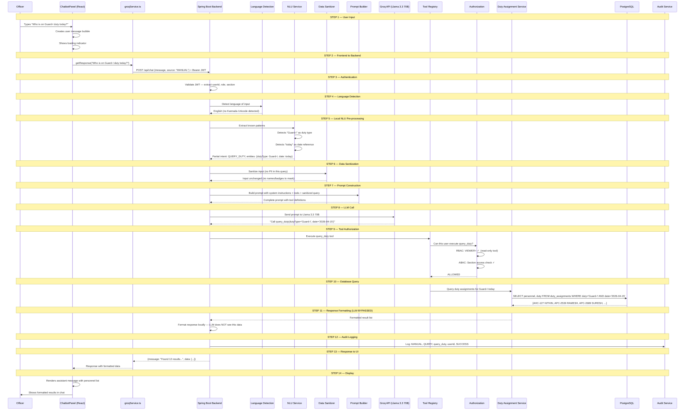

### What Happened at Each Step

| Step | Component | What It Did | Security Check |
|------|-----------|-------------|----------------|
| 1 | ChatbotPanel | Captured user input, showed loading state | — |
| 2 | groqService | Sent message to backend with JWT token | JWT attached |
| 3 | Spring Security | Validated JWT signature and expiry | Authentication |
| 4 | LanguageDetection | Detected English (Unicode range check) | — |
| 5 | NLU Service | Extracted duty type and date locally (no LLM needed) | — |
| 6 | DataSanitizer | Checked for PII to mask (none in this query) | PII protection |
| 7 | PromptBuilder | Built sanitized prompt with tool definitions | — |
| 8 | Groq API | LLM selected the right tool and parameters | — |
| 9 | Authorization | Verified user can execute this tool for this data | RBAC + ABAC |
| 10 | Database | Executed parameterized query | No raw SQL |
| 11 | Backend | Formatted results locally — LLM never saw the data | Data isolation |
| 12 | AuditService | Logged the complete action with context | Audit trail |
| 13-14 | Frontend | Displayed formatted results to officer | — |

---

## 12. Database Design

### Entity Relationship Diagram

```mermaid
erDiagram
    personnel {
        INT id PK
        VARCHAR name
        VARCHAR designation
        VARCHAR badge_number
        VARCHAR status
        VARCHAR phone
        DATE date_of_joining
    }

    sections {
        INT id PK
        VARCHAR name
        VARCHAR description
    }

    duty_assignments {
        INT id PK
        INT personnel_id FK
        VARCHAR duty
        VARCHAR duty_category
        VARCHAR work_location
        INT vehicle_id FK
        DATE start_date
    }

    vehicles {
        INT id PK
        VARCHAR vehicle_number
        VARCHAR vehicle_type
    }

    section_members {
        INT id PK
        INT personnel_id FK
        INT section_id FK
        VARCHAR sub_section
        VARCHAR shift_info
    }

    platoon_rotations {
        INT id PK
        VARCHAR platoon
        DATE date_from
        DATE date_to
        VARCHAR duty_description
    }

    platoon_members {
        INT id PK
        INT personnel_id FK
        VARCHAR platoon
    }

    leave_requests {
        INT id PK
        INT personnel_id FK
        INT leave_type_id FK
        DATE start_date
        DATE end_date
        VARCHAR status
    }

    leave_balances {
        INT id PK
        INT personnel_id FK
        INT leave_type_id FK
        INT year
        REAL opening_balance
        REAL used
        REAL closing_balance
    }

    leave_types {
        INT id PK
        VARCHAR code
        VARCHAR name
        INT max_per_year
    }

    daily_attendance {
        INT id PK
        INT personnel_id FK
        DATE date
        VARCHAR status
        VARCHAR duty_performed
        VARCHAR shift
    }

    training_assignments {
        INT id PK
        INT personnel_id FK
        VARCHAR training_name
        DATE start_date
        DATE expected_end_date
    }

    audit_logs {
        INT id PK
        TIMESTAMPTZ timestamp
        INT user_id
        VARCHAR source
        VARCHAR action_type
        VARCHAR target_table
        JSONB old_values
        JSONB new_values
        VARCHAR result
    }

    uploaded_documents {
        INT id PK
        VARCHAR filename
        VARCHAR document_type
        INT uploaded_by FK
        TIMESTAMPTZ uploaded_at
    }

    document_chunks {
        INT id PK
        INT document_id FK
        TEXT content
        VECTOR embedding
    }

    personnel ||--o{ duty_assignments : "assigned to"
    personnel ||--o{ section_members : "belongs to"
    personnel ||--o{ platoon_members : "member of"
    personnel ||--o{ leave_requests : "applies for"
    personnel ||--o{ leave_balances : "has balance"
    personnel ||--o{ daily_attendance : "tracked daily"
    personnel ||--o{ training_assignments : "enrolled in"
    vehicles ||--o{ duty_assignments : "used in"
    sections ||--o{ section_members : "contains"
    leave_types ||--o{ leave_requests : "categorized by"
    leave_types ||--o{ leave_balances : "tracked by"
    uploaded_documents ||--o{ document_chunks : "split into"
```

### Key Tables

| Table | Records | Purpose |
|-------|---------|---------|
| personnel | 572+ | All officers with rank, badge, status, contact |
| sections | 3 | Section A (Fixed), B (Support), C (Rotational) |
| duty_assignments | Dynamic | Current and historical duty postings |
| section_members | 572+ | Personnel-to-section mapping with sub-section detail |
| platoon_rotations | 5 per cycle | 15-day rotation schedule for 5 platoons |
| platoon_members | 277 | Section C personnel-to-platoon mapping |
| leave_requests | Dynamic | Leave applications with approval workflow |
| leave_balances | 572 × 11 types | Per-person per-year balance for all leave types |
| daily_attendance | Daily | Form 168 data — duty/status snapshot |
| audit_logs | Append-only | Immutable record of every system action |
| uploaded_documents | Dynamic | Scanned forms and rosters |
| document_chunks | Dynamic | OCR text chunks with pgvector embeddings for RAG |

---

## 13. Key Features Summary

### Personnel Management
- 572 personnel across 3 sections + PMT + recruits
- Rank hierarchy: DCP > ACP > RPI > RSI > ARSI > AHC > APC
- Badge-based identification (AHC-127, APC-2539)
- Status tracking: active, on-leave, absent, suspended, sick, training
- Sanctioned vs present strength with vacancy tracking

### Duty Management
- 15-day platoon rotation across 5 duty types (Guard-I, Guard-II, Check Point, Prison/VIP Escort, Striking Force)
- 22 guard locations with required personnel counts
- VIP escort assignments, gunman assignments, court duty, cash escort
- Check post shifts: A (05:00-13:00), B (13:00-21:00), C (21:00-05:00)
- Ad-hoc duty requests with full audit trail

### AI-Powered Features
- Natural language chat in English and Kannada
- Voice commands with confidence-based processing
- Document OCR with structured data extraction
- AI-generated fair duty schedules
- Intent recognition with automatic action execution
- RAG-based document querying

### Leave Management
- 11 leave types (EL, CL, HPL, PL, CML, RH, SCL, ML, CCL, EOL, PERM)
- Balance tracking with carry-forward rules
- Duty conflict detection on leave application
- Rank-based approval workflow

### Security and Compliance
- Zero Trust LLM architecture — PII never reaches the AI
- JWT authentication with auto-refresh
- RBAC + ABAC at every layer
- Immutable audit trail with source tracking
- Soft delete policy — no data ever physically removed
- AES-256 encryption for PII at rest

### Reporting and Analytics
- Real-time dashboard with section-wise metrics
- Duty coverage and rotation compliance reports
- Leave utilization analytics
- Personnel distribution (sanctioned vs actual)
- Exportable audit logs (CSV)

---

*Document prepared for client presentation.*
*Karnataka State Police — CAR MT Section AI-Powered Intelligent Data Management Platform*
*Version 1.0 | April 2026*
